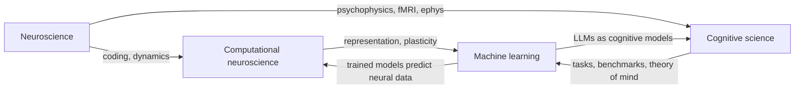

# Why neuroscience matters for AI/AGI

## The honest answer

The brain is the only existence proof of general intelligence we have. It runs on ~20 watts, learns from a handful of examples, generalizes out of distribution, and stays coherent for 80 years. Modern LLMs match or exceed it on narrow tasks while burning megawatts and hallucinating their own training data. Whatever the brain is doing, **we have not reproduced it**, even if we have surpassed it in places.

That is the case for caring. The case for **not** over-caring is that we may build AGI without ever resolving how cortex works. Take from neuroscience what is computationally clarifying; don't be religious about biological plausibility.

## Three honest claims about neuro → AI

1. **Neuroscience has historically lit the path.** Convolutional nets ([Hubel & Wiesel, 1962](https://www.ncbi.nlm.nih.gov/pmc/articles/PMC1359523/)), reinforcement learning ([Schultz, Dayan & Montague, 1997](https://www.gatsby.ucl.ac.uk/~dayan/papers/sdm97.pdf)), attention ([Itti & Koch, 2001](https://en.wikipedia.org/wiki/Saliency_map)), Hopfield networks ([Hopfield, 1982](https://www.pnas.org/doi/10.1073/pnas.79.8.2554)), Boltzmann machines, and dropout (loosely) all came from the brain.
2. **Most of cortex is still a mystery.** We do not know how cortex learns, how it composes, how it sleeps-and-consolidates, or how it does one-shot abstraction. These are open and they overlap with what AGI is missing.
3. **Convergence is real.** Trained CNNs predict V1/V2/V4/IT firing rates better than any hand-built model ([Yamins et al., 2014](https://www.pnas.org/doi/10.1073/pnas.1403112111)). Trained language models predict cortical responses to sentences ([Schrimpf et al., 2021](https://www.pnas.org/doi/10.1073/pnas.2105646118)). The brain and well-trained nets seem to be solving overlapping problems with overlapping solutions.

## What the brain still does that frontier AI does not

| Capability | Brain | Frontier AI (2025–26) |
|---|---|---|
| Continual learning without catastrophic forgetting | Routine | Open problem |
| Sample efficiency (one-shot, few-shot grounded) | Routine | Poor without scaffolding |
| Energy efficiency | ~20 W | 10⁵–10⁶× more |
| Embodied causal interaction | Yes | Robotics still brittle |
| Coherent multi-decade autobiography | Yes | Context-window bound |
| Sleep-driven consolidation, replay, abstraction | Yes | Replay buffers ≠ this |
| Self-modeling + metacognition | Plausible | Surface-level only |
| Goal genesis (wanting things from nothing) | Yes | No — externally specified rewards |

**🤖 AI-relevance.** Every row above is a research direction. AGI bets are essentially bets on which row will close first and how.

## The four big bridges between fields

1. **Representation bridge.** Both deep nets and cortex form hierarchical, distributed, factorized codes. Studied by [Yamins & DiCarlo, 2016](https://www.ncbi.nlm.nih.gov/pmc/articles/PMC6526887/).
2. **Learning bridge.** Backprop vs biologically-plausible local rules. ([Lillicrap et al., 2020](https://arxiv.org/abs/2004.13316)).
3. **Inference bridge.** Bayesian brain, predictive coding, free energy. ([Friston, 2010](https://www.fil.ion.ucl.ac.uk/~karl/The%20free-energy%20principle%20A%20unified%20brain%20theory.pdf)).
4. **Behavior bridge.** RL, model-based cognition, planning. ([Sutton & Barto, 2nd ed. 2018, free PDF](http://incompleteideas.net/book/the-book-2nd.html)).

## Authoritative single-source starting points

- **Textbook:** [Kandel — Principles of Neural Science, 6e](https://en.wikipedia.org/wiki/Principles_of_Neural_Science) — the canonical reference. Read selectively.
- **Computational textbook:** [Dayan & Abbott — Theoretical Neuroscience](https://en.wikipedia.org/wiki/Theoretical_neuroscience) — the field's standard text. PDF widely available.
- **Free course:** [Neuromatch Academy — Computational Neuroscience](https://compneuro.neuromatch.io/) — Python-first, taught by leading researchers, runs every summer.
- **Free course:** [Neuromatch — Deep Learning](https://deeplearning.neuromatch.io/) — its sibling course, neuro-flavored.
- **Survey:** [Hassabis et al., 2017 — Neuroscience-Inspired AI](https://arxiv.org/abs/1709.05206) — the DeepMind manifesto for this whole field.
- **Survey:** [Richards et al., 2019 — A deep learning framework for neuroscience](https://www.ncbi.nlm.nih.gov/pmc/articles/PMC7115933/) — the inverse direction.

## How to read this part of the guide skeptically

Hold two things at once:

- The brain is the only existence proof.
- The brain is not the only valid solution. Don't over index on the brain.

The most productive AI researchers in this space (DeepMind, Numenta, MIT BCS, Stanford, the Mila / Bengio crowd) treat neuroscience as a **source of inductive biases and existence proofs**, not as a target to reverse-engineer. That's the posture this guide will keep.
