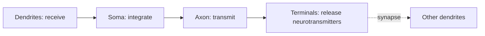

# The neuron: biophysics & spikes

## The minimum you need to remember

A neuron is a leaky, threshold-gated, time-extended integrator that emits 1-bit pulses ("spikes" / action potentials) and communicates them down a long wire (axon) to other neurons via chemical synapses.



## The 5 facts to internalize

1. **Membrane potential.** Resting voltage ~−70 mV across the cell membrane, maintained by ion pumps (Na⁺/K⁺-ATPase) and selective channels.
2. **Action potential = spike.** When the membrane crosses ~−55 mV, voltage-gated Na⁺ channels open, the cell briefly inverts polarity to ~+30 mV, then repolarizes. ~1–2 ms event.
3. **All-or-nothing.** A spike is binary. Information lives in spike **timing** and **rate**, not amplitude.
4. **Refractory period.** ~2 ms after a spike, the neuron can't fire again. Caps firing rate at a few hundred Hz.
5. **Conduction.** Spikes travel down the axon at 0.5–120 m/s depending on myelination and diameter.

## The Hodgkin-Huxley model (1952)

The Nobel-winning differential equations describing a spike. Four variables: V (voltage), m, h, n (channel gating).

$$
C\frac{dV}{dt} = -g_{Na}m^3h(V-E_{Na}) - g_K n^4(V-E_K) - g_L(V-E_L) + I
$$

You will rarely simulate this in AI work, but you should recognize it. [Original paper (1952)](https://www.ncbi.nlm.nih.gov/pmc/articles/PMC1392413/).

**🤖 AI-relevance.** Modern deep learning ignores almost all of this. ReLU is a memoryless instantaneous nonlinearity; a real neuron is a **dynamical system with memory and refractory dynamics**. Spiking neural networks (Ch 24) try to recover this.

## Simpler models you'll actually see

| Model | What it is | When used |
|---|---|---|
| **Leaky integrate-and-fire (LIF)** | dV/dt = -(V-V_rest)/τ + I; spike when V crosses θ, then reset | Default in computational neuroscience and neuromorphic |
| **Izhikevich (2003)** | 2 ODEs, can reproduce ~20 firing patterns | When you want diversity cheap |
| **Generalized linear model (GLM)** | Poisson spikes, linear filter + nonlinearity | Statistical fitting to real data |
| **Rate model** | Real-valued "firing rate" continuous variable | What deep learning units approximate |

Read: [Izhikevich, 2003 — Simple model of spiking neurons](https://www.izhikevich.org/publications/spikes.pdf).

## Dendrites are not passive wires

A naive view: dendrites sum inputs linearly, soma decides. Real view: dendrites perform local nonlinear computations — NMDA spikes, dendritic plateaus, branch-specific learning. A pyramidal neuron is closer to a small multi-layer network than a single unit.

📄 [Beniaguev, Segev & London, 2021 — Single cortical neurons as deep ANNs](https://www.biorxiv.org/content/10.1101/613141v2.full) — they fit a deep (5–8 layer) network to match a single L5 pyramidal neuron's I/O. Sobering.

**🤖 AI-relevance.** This paper is the strongest single argument that "1 ANN unit ≈ 1 neuron" is wrong by 2–3 orders of magnitude. Pure scaling debates often skip this.

## Neuron types you'll hear named

- **Pyramidal neurons** — excitatory, glutamatergic, the workhorse of cortex.
- **Interneurons** — inhibitory, GABAergic. Three big classes: PV (parvalbumin, fast spiking, blanket inhibition), SOM (somatostatin, dendrite-targeting), VIP (vasoactive intestinal peptide, disinhibitory).
- **Purkinje cells** — cerebellum, huge dendritic tree, ~200,000 inputs.
- **Granule cells** — densely packed, sparse coding.
- **Dopaminergic neurons** (VTA, SNc) — broadcast reward prediction error (Ch 09).

## 🧪 Try-it

Install [Brian2](https://briansimulator.org/) in a notebook:

```python
from brian2 import *
eqs = 'dv/dt = (1 - v) / (10*ms) : 1'
G = NeuronGroup(1, eqs, threshold='v>0.8', reset='v=0', method='exact')
M = StateMonitor(G, 'v', record=0)
run(100*ms)
plot(M.t/ms, M.v[0])
```

You've simulated a leaky integrator. Add input current, watch it spike.

## Sources for going deeper

- [Gerstner et al. — Neuronal Dynamics (free online textbook)](https://neuronaldynamics.epfl.ch/) — the best free intro to spiking neuron models.
- [Scholarpedia — Hodgkin-Huxley model](https://en.wikipedia.org/wiki/Hodgkin%E2%80%93Huxley_model) — reviewed by Huxley himself.
- Kandel ch 6–9 for biophysics, ch 11 for ion channels.
