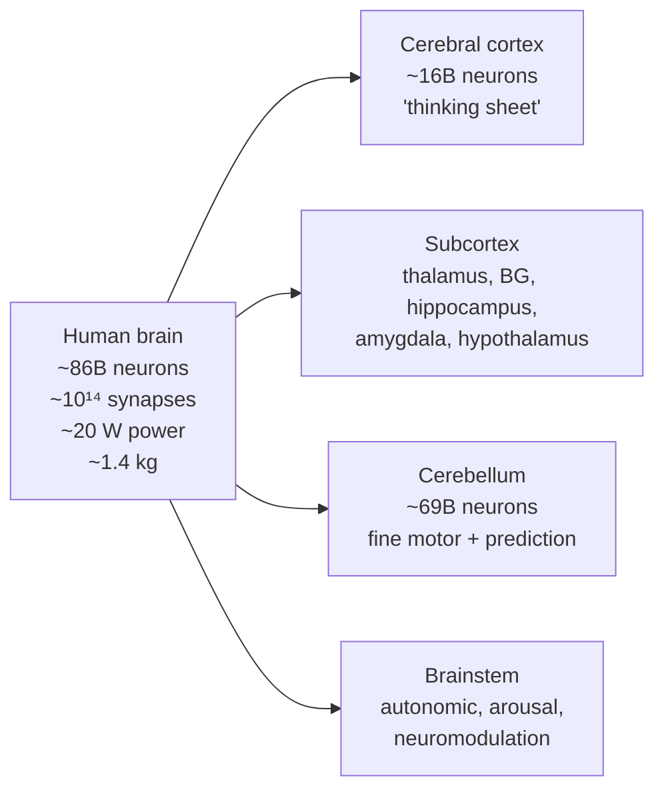
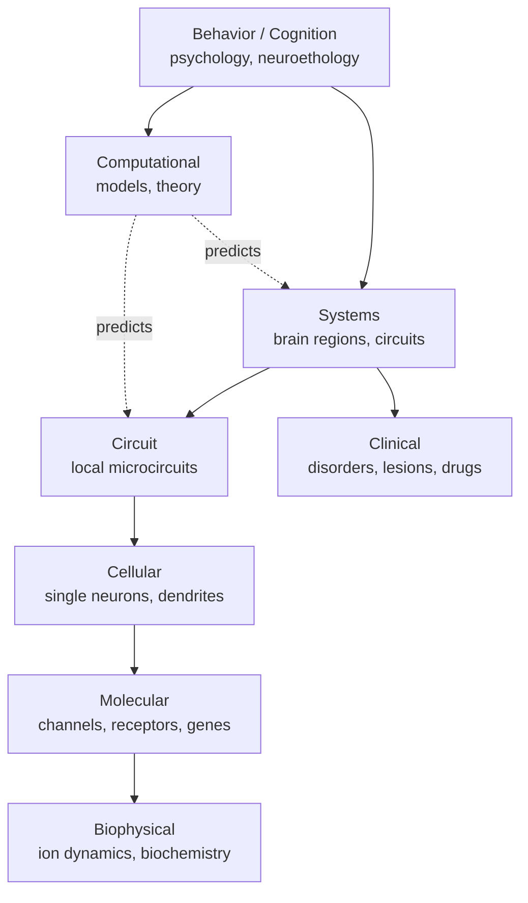
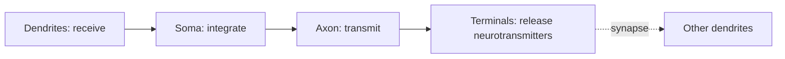

# The brain, neuroscience, and the neuron

Before zooming into a single cell, take the wide-angle view. This chapter has three parts: (1) what the human brain *is*, (2) what the field of *neuroscience* studies and how, (3) where neuroscience and AI/ML actually overlap, agree, and disagree. The original neuron-biophysics material follows after.

## The human brain at a glance



Numbers worth memorizing:

| Quantity | Value |
|---|---|
| Neurons | ~86 billion ([Herculano-Houzel, 2009](https://www.frontiersin.org/articles/10.3389/neuro.09.031.2009/full)) |
| Synapses | ~10¹⁴ — every neuron averages ~7,000 synapses |
| Power consumption | ~20 W — about a dim lightbulb |
| Mass | ~1.4 kg, ~2% of body weight, ~20% of energy budget |
| Cortex thickness | 2–4 mm sheet, folded into ~2,500 cm² |
| Conduction speed | 0.5 – 120 m/s along axons |
| Spike rate | ~0.1 – 100 Hz typical; ~200 Hz absolute ceiling |

A useful mental model: the brain is a **massively parallel, recurrent, self-modifying, biochemically powered analog computer** that is interfaced to a body and embedded in a world. Every word in that sentence matters, and most differ from how a GPU runs an LLM.

📄 [Herculano-Houzel, 2009 — The human brain in numbers: a linearly scaled-up primate brain](https://www.frontiersin.org/articles/10.3389/neuro.09.031.2009/full). Authoritative source for the 86-billion-neuron figure (revising the long-cited 100B).

📄 [Sterling & Laughlin — Principles of Neural Design (2015)](https://en.wikipedia.org/wiki/Peter_Sterling_(neuroscientist)). Best argument that **energy efficiency is the dominant constraint** shaping brain architecture — a constraint AI accelerators do not face the same way.

### The hierarchical layout (preview of Ch 04)

- **Brainstem** — keeps you alive: breathing, heart rate, sleep/wake, arousal, autonomic regulation. Houses most of the **neuromodulatory nuclei** (dopamine, noradrenaline, serotonin, acetylcholine).
- **Cerebellum** — fine motor coordination, timing, learned forward models. Contains *most* of the brain's neurons by count.
- **Thalamus** — central relay between cortex and the rest of the brain. Every cortical area has a thalamic partner.
- **Basal ganglia** — action selection and reinforcement learning.
- **Hippocampus** — episodic memory, spatial cognition, replay-based consolidation.
- **Amygdala** — emotional valence, fear conditioning, salience.
- **Hypothalamus** — drives, homeostasis, hormones — *where wanting comes from*.
- **Neocortex** — the 6-layer "thinking sheet": vision, language, planning, abstraction, motor commands.

### The neuron, in one paragraph (full chapter starts below)

A neuron is an electrically excitable cell with **dendrites** (input branches), a **soma** (cell body that integrates), an **axon** (output wire), and **synapses** where it connects to other neurons. It maintains a voltage across its membrane (~–70 mV at rest) and emits ~1-ms binary pulses (**action potentials** / spikes) when input pushes the voltage past a threshold. Spikes propagate down the axon and trigger chemical signaling at synapses. *That's the unit.*

## The field of neuroscience

Neuroscience is the multidisciplinary study of nervous systems. It spans roughly nine levels of abstraction, each with its own methods, journals, and intellectual culture:



### The major subfields

| Subfield | What it studies | Relevant to AI? |
|---|---|---|
| **Molecular & cellular** | Channels, receptors, gene expression in neurons | Indirectly — informs realistic neuron models |
| **Systems** | How brain regions coordinate to produce behavior | Yes — most NeuroAI lives here |
| **Cognitive** | Attention, memory, language, decision-making in humans | Yes — directly inspires LLM/agent capabilities |
| **Computational** | Mathematical / algorithmic models of neural computation | Yes — the bridge field |
| **Behavioral** | Animal & human behavior in controlled tasks | Yes — RL benchmarks, theory of mind |
| **Clinical / translational** | Disorders, brain injury, pharmacology | Tangentially — alignment lessons from addiction etc. |
| **Developmental** | How brains wire up over development | Yes — curriculum learning, growth |
| **Evolutionary / comparative** | Brains across species | Yes — what's *species-typical* vs *general*? |

📄 [Carandini, 2012 — From circuits to behavior: a bridge too far?](https://www.nature.com/articles/nn.3043). Asks the field's hardest question — can we explain behavior from circuits, or are there irreducible levels?

📄 [Krakauer, Ghazanfar, Gomez-Marin, MacIver & Poeppel, 2017 — Neuroscience needs behavior](https://en.wikipedia.org/wiki/Behavioral_neuroscience). The case that the field over-instrumented and under-theorized; recordings without good behavioral tasks teach you little. **Lesson for AI**: benchmarks shape what models become.

### Methods you'll see referenced everywhere

| Method | Resolution | What it measures |
|---|---|---|
| **EEG** | seconds → ms, cm | Scalp electrical activity, summed |
| **MEG** | ms, cm | Scalp magnetic fields, summed |
| **fMRI** | seconds, mm | Blood-oxygenation proxy for activity |
| **ECoG / iEEG** | ms, mm | Cortical surface electrodes (in epilepsy patients) |
| **Single-unit / multi-unit ephys** | sub-ms, single neuron | Direct spike recording with electrodes |
| **Neuropixels** | sub-ms, hundreds of neurons at once | High-channel-count silicon probes |
| **Two-photon Ca²⁺ imaging** | ~10s of ms, micron, ~10³ neurons | Calcium fluorescence as activity proxy |
| **Optogenetics** | ms, single cell type | Light-gated channels — *causally* perturb specific neurons |
| **Electron-microscopy connectomics** | nanometer, structural only | Full wiring diagrams |

📄 [Steinmetz et al., 2019 — Distributed coding of choice, action and engagement across the mouse brain](https://figshare.com/articles/dataset/Distributed_coding_of_choice_action_and_engagement_across_the_mouse_brain/9598406). The Neuropixels-era flagship dataset — 30,000 neurons across the mouse brain during behavior.

📄 [Deisseroth, 2015 — Optogenetics: 10 years of microbial opsins in neuroscience](https://www.nature.com/articles/nn.4091). The technique that made neuroscience *causal*, not just correlational. Transforming.

### The "explanatory levels" idea

📄 [Marr, 1982 — Vision (book, posthumously published)](https://en.wikipedia.org/wiki/David_Marr_(neuroscientist)). Marr's three levels — **computational** (what is the system solving?), **algorithmic** (how is it represented and computed?), **implementational** (how does the hardware realize it?) — are still the field's organizing schema. Almost every NeuroAI paper implicitly sits at one or two of these levels.

**🤖 AI-relevance.** Marr's framework applies directly to AI. Most ML papers operate at the algorithmic level; mechanistic-interpretability work is reverse-engineering the implementational level; alignment research is fundamentally a *computational-level* question (what should the system want?).

## Neuroscience × AI/ML: insights, parallels, and differences

Both fields study **information-processing systems that learn from data**. They have been shaping each other for 80 years (McCulloch & Pitts 1943, Hebb 1949, Rosenblatt 1958, Hopfield 1982, Schultz-Dayan-Montague 1997, Hubel-Wiesel → CNNs, dopamine → TD-learning). The relationship is a genuine two-way bridge: neuroscience inspires architectures, ML produces models that turn out to predict neural data.

### Major parallels (where the fields agree)

| Idea | In the brain | In ML |
|---|---|---|
| **Distributed, hierarchical representations** | Cortex builds increasingly abstract features | Deep nets do the same; CNN top layers ≈ IT cortex |
| **Reinforcement learning** | Phasic dopamine = TD error in basal ganglia | Sutton-Barto-style RL; actor-critic ≈ BG architecture |
| **Predictive / generative models** | Predictive coding, Bayesian brain | Self-supervised learning, JEPA, diffusion |
| **Attention as biased competition** | Top-down PFC biases sensory cortex | Soft attention / transformers |
| **Replay & consolidation** | Hippocampal sharp-wave ripples → cortex | Experience replay (DQN), generative replay |
| **Sparse codes** | V1 sparse coding | Sparse autoencoders for interpretability |
| **Mixed selectivity / random features** | PFC neurons code arbitrary nonlinear mixtures | Wide hidden layers + linear readout |
| **Modular yet interconnected** | Specialized regions with extensive communication | Mixture-of-experts; modular networks |

### Major differences (where the fields diverge)

| Property | Brain | Frontier ML |
|---|---|---|
| **Substrate** | Wet biochemistry, ion gradients, ~20 W | Silicon GPUs, megawatts |
| **Learning rule** | Local, online, neuromodulator-gated; *no global backprop known* | Backpropagation (non-local, batched, offline) |
| **Time** | Continuous-time dynamical system; rhythms (theta, gamma) carry information | Discrete time steps; rhythms are an afterthought |
| **Recurrence** | Massively recurrent everywhere | Mostly feedforward (transformers, CNNs); RNNs are minority |
| **Sample efficiency** | Few-shot, lifelong, embodied | Pretraining on ~10¹³ tokens; few-shot is *in-context*, not real |
| **Continual learning** | Routine; sleep consolidates without forgetting | Catastrophic forgetting; needs replay or freezing |
| **Embodiment** | Always embodied; cognition serves a body | Disembodied (with rare exceptions) |
| **Goal genesis** | Drives from hypothalamus, hardwired & learned | Externally specified rewards / instructions |
| **Self-modeling** | Metacognition, confidence, theory of mind | Surface-level; calibration is poor |
| **Hardware/algorithm coupling** | Highly entangled | Decoupled by design |

### Three productive cross-overs you should know

**1. Existence proofs.** The brain proves that *some* algorithm can do continual learning, sample-efficient generalization, and 80-year coherent autobiography on 20 W. Whatever it is, it is *physically possible*. That alone is information.

**2. Scientific modeling.** Trained ANNs are now the **best predictive models of sensory cortex** ([Yamins et al., 2014](https://www.pnas.org/doi/10.1073/pnas.1403112111); [Schrimpf et al., 2021](https://www.pnas.org/doi/10.1073/pnas.2105646118)). ML is becoming an instrument of neuroscience. Note this does *not* mean cortex implements a transformer — it means whatever cortex does is in the same representational neighborhood as a well-trained net.

**3. Reverse direction — neuroscience methods migrating to ML interpretability.** Sparse coding ([Olshausen & Field, 1996](https://www.rctn.org/bruno/papers/sparse-coding.pdf)) is now the dominant tool of LLM mechanistic interpretability ([Anthropic — Towards Monosemanticity, 2024](https://transformer-circuits.pub/2024/scaling-monosemanticity/index.html)). Linear probes, RSA, lesioning, ablation — all neuroscience-native methods, now applied to neural networks. *The instruments are flowing both ways.*

### What neuroscience suggests AI is missing (preview of Ch 25)

- A real long-term memory + offline consolidation system (≈ hippocampus + sleep).
- Local, neuromodulator-gated learning rules that work continually (≈ three-factor STDP).
- Embodied, homeostatic agency with intrinsic drives (≈ hypothalamus).
- Forward + inverse world models that support counterfactual simulation (≈ cerebellum + PFC).
- Genuine metacognition: knowing what you don't know (≈ rostrolateral PFC + ACC).

These are five distinct rows on the AGI gap table. Each is a real open research direction, and each has at least one biological existence proof.

📄 **Required reading for this perspective**:
- [Hassabis, Kumaran, Summerfield & Botvinick, 2017 — Neuroscience-Inspired Artificial Intelligence](https://en.wikipedia.org/wiki/Neuroscience#Neuroscience_and_artificial_intelligence) — the DeepMind manifesto.
- [Lake, Ullman, Tenenbaum & Gershman, 2017 — Building machines that learn and think like people](https://arxiv.org/abs/1604.00289) — the cognitive-science manifesto.
- [Richards et al., 2019 — A deep learning framework for neuroscience](https://www.ncbi.nlm.nih.gov/pmc/articles/PMC7115933/) — the inverse direction.
- [Doerig et al., 2023 — The neuroconnectionist research programme](https://arxiv.org/abs/2209.03718) — the field's current self-portrait.

### Honest caveat

Most working AI researchers do *not* derive new architectures from neuroscience. Transformers, diffusion models, RLHF — none came directly from neuro. But the *questions* neuroscience forces ("how do you do credit assignment without backprop? how do you keep learning without forgetting? what makes a system want anything?") are the same questions AGI must answer. **Read neuroscience for the questions, not the answers.**

---

## The neuron: biophysics & spikes

## The minimum you need to remember

A neuron is a leaky, threshold-gated, time-extended integrator that emits 1-bit pulses ("spikes" / action potentials) and communicates them down a long wire (axon) to other neurons via chemical synapses.



## The 5 facts to internalize

1. **Membrane potential.** Resting voltage ~−70 mV across the cell membrane, maintained by ion pumps (Na⁺/K⁺-ATPase) and selective channels.
2. **Action potential = spike.** When the membrane crosses ~−55 mV, voltage-gated Na⁺ channels open, the cell briefly inverts polarity to ~+30 mV, then repolarizes. ~1–2 ms event.
3. **All-or-nothing.** A spike is binary. Information lives in spike **timing** and **rate**, not amplitude.
4. **Refractory period.** ~2 ms after a spike, the neuron can't fire again. Caps firing rate at a few hundred Hz.
5. **Conduction.** Spikes travel down the axon at 0.5–120 m/s depending on myelination and diameter.

## The Hodgkin-Huxley model (1952)

The Nobel-winning differential equations describing a spike. Four variables: V (voltage), m, h, n (channel gating).

$$
C\frac{dV}{dt} = -g_{Na}m^3h(V-E_{Na}) - g_K n^4(V-E_K) - g_L(V-E_L) + I
$$

You will rarely simulate this in AI work, but you should recognize it. [Original paper (1952)](https://www.ncbi.nlm.nih.gov/pmc/articles/PMC1392413/).

**🤖 AI-relevance.** Modern deep learning ignores almost all of this. ReLU is a memoryless instantaneous nonlinearity; a real neuron is a **dynamical system with memory and refractory dynamics**. Spiking neural networks (Ch 24) try to recover this.

## Simpler models you'll actually see

| Model | What it is | When used |
|---|---|---|
| **Leaky integrate-and-fire (LIF)** | dV/dt = -(V-V_rest)/τ + I; spike when V crosses θ, then reset | Default in computational neuroscience and neuromorphic |
| **Izhikevich (2003)** | 2 ODEs, can reproduce ~20 firing patterns | When you want diversity cheap |
| **Generalized linear model (GLM)** | Poisson spikes, linear filter + nonlinearity | Statistical fitting to real data |
| **Rate model** | Real-valued "firing rate" continuous variable | What deep learning units approximate |

Read: [Izhikevich, 2003 — Simple model of spiking neurons](https://www.izhikevich.org/publications/spikes.pdf).

## Dendrites are not passive wires

A naive view: dendrites sum inputs linearly, soma decides. Real view: dendrites perform local nonlinear computations — NMDA spikes, dendritic plateaus, branch-specific learning. A pyramidal neuron is closer to a small multi-layer network than a single unit.

📄 [Beniaguev, Segev & London, 2021 — Single cortical neurons as deep ANNs](https://en.wikipedia.org/wiki/Pyramidal_cell) — they fit a deep (5–8 layer) network to match a single L5 pyramidal neuron's I/O. Sobering.

**🤖 AI-relevance.** This paper is the strongest single argument that "1 ANN unit ≈ 1 neuron" is wrong by 2–3 orders of magnitude. Pure scaling debates often skip this.

## Neuron types you'll hear named

- **Pyramidal neurons** — excitatory, glutamatergic, the workhorse of cortex.
- **Interneurons** — inhibitory, GABAergic. Three big classes: PV (parvalbumin, fast spiking, blanket inhibition), SOM (somatostatin, dendrite-targeting), VIP (vasoactive intestinal peptide, disinhibitory).
- **Purkinje cells** — cerebellum, huge dendritic tree, ~200,000 inputs.
- **Granule cells** — densely packed, sparse coding.
- **Dopaminergic neurons** (VTA, SNc) — broadcast reward prediction error (Ch 09).

## 🧪 Try-it

Install [Brian2](https://briansimulator.org/) in a notebook:

```python
from brian2 import *
eqs = 'dv/dt = (1 - v) / (10*ms) : 1'
G = NeuronGroup(1, eqs, threshold='v>0.8', reset='v=0', method='exact')
M = StateMonitor(G, 'v', record=0)
run(100*ms)
plot(M.t/ms, M.v[0])
```

You've simulated a leaky integrator. Add input current, watch it spike.

## Sources for going deeper

- [Gerstner et al. — Neuronal Dynamics (free online textbook)](https://neuronaldynamics.epfl.ch/) — the best free intro to spiking neuron models.
- [Scholarpedia — Hodgkin-Huxley model](https://en.wikipedia.org/wiki/Hodgkin%E2%80%93Huxley_model) — reviewed by Huxley himself.
- Kandel ch 6–9 for biophysics, ch 11 for ion channels.
