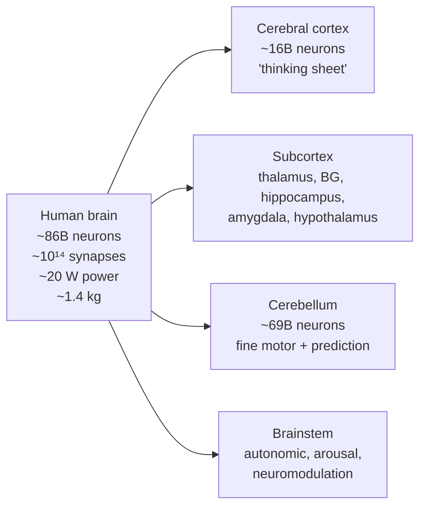

# The brain, neuroscience, and the neuron

Before zooming into a single cell, take the wide-angle view. This three-part chapter (02a → 02b → 02c) covers (1) what the human brain *is*, (2) what the field of *neuroscience* studies and how it relates to AI/ML, (3) the biophysics of a single neuron.

## The human brain at a glance

Numbers worth memorizing:

| Quantity | Value |
|---|---|
| Neurons | ~86 billion ([Herculano-Houzel, 2009](https://www.frontiersin.org/articles/10.3389/neuro.09.031.2009/full)) |
| Synapses | ~10¹⁴ — every neuron averages ~7,000 synapses |
| Power consumption | ~20 W — about a dim lightbulb |
| Mass | ~1.4 kg, ~2% of body weight, ~20% of energy budget |
| Cortex thickness | 2–4 mm sheet, folded into ~2,500 cm² |
| Conduction speed | 0.5 – 120 m/s along axons |
| Spike rate | ~0.1 – 100 Hz typical; ~200 Hz absolute ceiling |

A useful mental model: the brain is a **massively parallel, recurrent, self-modifying, biochemically powered analog computer** that is interfaced to a body and embedded in a world. Every word in that sentence matters, and most differ from how a GPU runs an [LLM](https://en.wikipedia.org/wiki/Large_language_model).

📄 [Herculano-Houzel, 2009 — The human brain in numbers: a linearly scaled-up primate brain](https://www.frontiersin.org/articles/10.3389/neuro.09.031.2009/full). Authoritative source for the 86-billion-neuron figure (revising the long-cited 100B).

> Herculano-Houzel introduced the **isotropic fractionator**, a method that dissolves brain tissue into a homogeneous nuclear suspension that can be counted directly, replacing decades of indirect stereological estimates. Applying it to the human brain yielded ~86 billion neurons total — about 16 billion in the cerebral cortex and a striking 69 billion in the cerebellum. The previously textbook figure of 100 billion neurons turned out to be a casual estimate that had ossified into accepted fact for over half a century. She also showed that the human brain follows the same neuron-density scaling rules as other primate brains, contradicting the older claim that humans are evolutionary outliers in cellular composition. The result reframes "what makes humans special" away from raw neuron count and toward connectivity, cortical organization, and developmental trajectory.

📄 [Sterling & Laughlin — Principles of Neural Design (2015)](https://direct.mit.edu/books/oa-monograph/4128/Principles-of-Neural-Design). Best argument that **energy efficiency is the dominant constraint** shaping brain architecture — a constraint AI accelerators do not face the same way.

### The hierarchical layout (preview of Ch 04)

- **Brainstem** — keeps you alive: breathing, heart rate, sleep/wake, arousal, autonomic regulation. Houses most of the **neuromodulatory nuclei** (dopamine, noradrenaline, serotonin, acetylcholine).
- **Cerebellum** — fine motor coordination, timing, learned forward models. Contains *most* of the brain's neurons by count.
- **Thalamus** — central relay between cortex and the rest of the brain. Every cortical area has a thalamic partner.
- **Basal ganglia** — action selection and reinforcement learning.
- **Hippocampus** — episodic memory, spatial cognition, replay-based consolidation.
- **Amygdala** — emotional valence, fear conditioning, salience.
- **Hypothalamus** — drives, homeostasis, hormones — *where wanting comes from*.
- **Neocortex** — the 6-layer "thinking sheet": vision, language, planning, abstraction, motor commands.

### The neuron, in one paragraph

A neuron is an electrically excitable cell with **dendrites** (input branches), a **soma** (cell body that integrates), an **axon** (output wire), and **synapses** where it connects to other neurons. It maintains a voltage across its membrane (~–70 mV at rest) and emits ~1-ms binary pulses (**action potentials** / spikes) when input pushes the voltage past a threshold. Spikes propagate down the axon and trigger chemical signaling at synapses. *That's the unit.*
