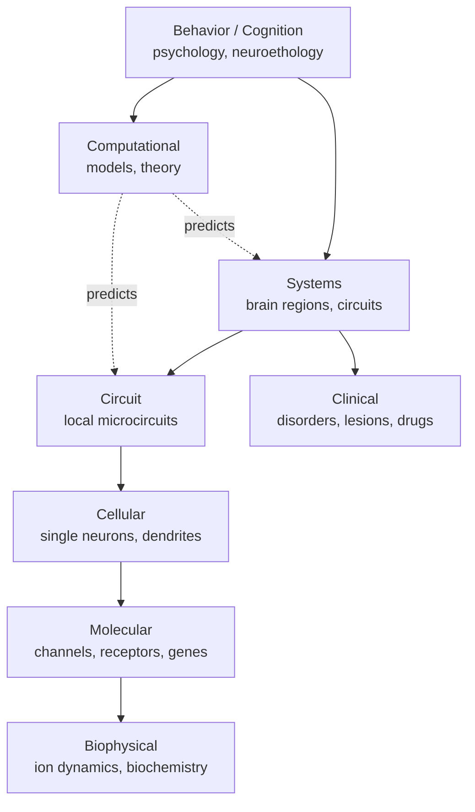

# The field of neuroscience, and its relationship to AI/ML

This chapter (02b) covers what neuroscience *as a field* studies, the methods it uses, and where it converges with — and diverges from — modern AI and machine learning.

## The field of neuroscience

Neuroscience is the multidisciplinary study of nervous systems. It spans roughly nine levels of abstraction, each with its own methods, journals, and intellectual culture:

### The major subfields

| Subfield | What it studies | Relevant to AI? |
|---|---|---|
| **Molecular & cellular** | Channels, receptors, gene expression in neurons | Indirectly — informs realistic neuron models |
| **Systems** | How brain regions coordinate to produce behavior | Yes — most NeuroAI lives here |
| **Cognitive** | Attention, memory, language, decision-making in humans | Yes — directly inspires [LLM](https://en.wikipedia.org/wiki/Large_language_model)/agent capabilities |
| **Computational** | Mathematical / algorithmic models of neural computation | Yes — the bridge field |
| **Behavioral** | Animal & human behavior in controlled tasks | Yes — [RL](https://en.wikipedia.org/wiki/Reinforcement_learning) benchmarks, theory of mind |
| **Clinical / translational** | Disorders, brain injury, pharmacology | Tangentially — alignment lessons from addiction etc. |
| **Developmental** | How brains wire up over development | Yes — curriculum learning, growth |
| **Evolutionary / comparative** | Brains across species | Yes — what's *species-typical* vs *general*? |

📄 [Carandini, 2012 — From circuits to behavior: a bridge too far?](https://www.nature.com/articles/nn.3043). Asks the field's hardest question — can we explain behavior from circuits, or are there irreducible levels?

📄 [Krakauer, Ghazanfar, Gomez-Marin, MacIver & Poeppel, 2017 — Neuroscience needs behavior](https://doi.org/10.1016/j.neuron.2016.12.041). The case that the field over-instrumented and under-theorized; recordings without good behavioral tasks teach you little. **Lesson for AI**: benchmarks shape what models become.

### Methods you'll see referenced everywhere

| Method | Resolution | What it measures |
|---|---|---|
| **[EEG](https://en.wikipedia.org/wiki/Electroencephalography)** | seconds → ms, cm | Scalp electrical activity, summed |
| **[MEG](https://en.wikipedia.org/wiki/Magnetoencephalography)** | ms, cm | Scalp magnetic fields, summed |
| **[fMRI](https://en.wikipedia.org/wiki/Functional_magnetic_resonance_imaging)** | seconds, mm | Blood-oxygenation proxy for activity |
| **[ECoG](https://en.wikipedia.org/wiki/Electrocorticography) / iEEG** | ms, mm | Cortical surface electrodes (in epilepsy patients) |
| **Single-unit / multi-unit ephys** | sub-ms, single neuron | Direct spike recording with electrodes |
| **Neuropixels** | sub-ms, hundreds of neurons at once | High-channel-count silicon probes |
| **Two-photon Ca²⁺ imaging** | ~10s of ms, micron, ~10³ neurons | Calcium fluorescence as activity proxy |
| **Optogenetics** | ms, single cell type | Light-gated channels — *causally* perturb specific neurons |
| **Electron-microscopy connectomics** | nanometer, structural only | Full wiring diagrams |

📄 [Steinmetz et al., 2019 — Distributed coding of choice, action and engagement across the mouse brain](https://figshare.com/articles/dataset/Distributed_coding_of_choice_action_and_engagement_across_the_mouse_brain/9598406). The Neuropixels-era flagship dataset — 30,000 neurons across the mouse brain during behavior.

📄 [Deisseroth, 2015 — Optogenetics: 10 years of microbial opsins in neuroscience](https://www.nature.com/articles/nn.4091). The technique that made neuroscience *causal*, not just correlational. Transforming.

### The "explanatory levels" idea

📄 [Marr, 1982 — Vision (book, posthumously published)](https://en.wikipedia.org/wiki/David_Marr_(neuroscientist)). Marr's three levels — **computational** (what is the system solving?), **algorithmic** (how is it represented and computed?), **implementational** (how does the hardware realize it?) — are still the field's organizing schema. Almost every NeuroAI paper implicitly sits at one or two of these levels.

**🤖 AI-relevance.** Marr's framework applies directly to AI. Most ML papers operate at the algorithmic level; mechanistic-interpretability work is reverse-engineering the implementational level; alignment research is fundamentally a *computational-level* question (what should the system want?).

## Neuroscience × AI/ML: insights, parallels, and differences

Both fields study **information-processing systems that learn from data**. They have been shaping each other for 80 years (McCulloch & Pitts 1943, Hebb 1949, Rosenblatt 1958, Hopfield 1982, Schultz-Dayan-Montague 1997, Hubel-Wiesel → CNNs, dopamine → [TD](https://en.wikipedia.org/wiki/Temporal_difference_learning)-learning). The relationship is a genuine two-way bridge: neuroscience inspires architectures, ML produces models that turn out to predict neural data.

### Major parallels (where the fields agree)

| Idea | In the brain | In ML |
|---|---|---|
| **Distributed, hierarchical representations** | Cortex builds increasingly abstract features | Deep nets do the same; [CNN](https://en.wikipedia.org/wiki/Convolutional_neural_network) top layers ≈ [IT](https://en.wikipedia.org/wiki/Inferior_temporal_gyrus) cortex |
| **Reinforcement learning** | Phasic dopamine = TD error in basal ganglia | Sutton-Barto-style RL; actor-critic ≈ [BG](https://en.wikipedia.org/wiki/Basal_ganglia) architecture |
| **Predictive / generative models** | Predictive coding, Bayesian brain | Self-supervised learning, [JEPA](https://ai.meta.com/blog/yann-lecun-advances-in-ai-research/), diffusion |
| **Attention as biased competition** | Top-down [PFC](https://en.wikipedia.org/wiki/Prefrontal_cortex) biases sensory cortex | Soft attention / transformers |
| **Replay & consolidation** | Hippocampal sharp-wave ripples → cortex | Experience replay ([DQN](https://en.wikipedia.org/wiki/Q-learning)), generative replay |
| **Sparse codes** | [V1](https://en.wikipedia.org/wiki/Visual_cortex) sparse coding | Sparse autoencoders for interpretability |
| **Mixed selectivity / random features** | PFC neurons code arbitrary nonlinear mixtures | Wide hidden layers + linear readout |
| **Modular yet interconnected** | Specialized regions with extensive communication | Mixture-of-experts; modular networks |

### Major differences (where the fields diverge)

| Property | Brain | Frontier ML |
|---|---|---|
| **Substrate** | Wet biochemistry, ion gradients, ~20 W | Silicon GPUs, megawatts |
| **Learning rule** | Local, online, neuromodulator-gated; *no global backprop known* | Backpropagation (non-local, batched, offline) |
| **Time** | Continuous-time dynamical system; rhythms (theta, gamma) carry information | Discrete time steps; rhythms are an afterthought |
| **Recurrence** | Massively recurrent everywhere | Mostly feedforward (transformers, CNNs); RNNs are minority |
| **Sample efficiency** | Few-shot, lifelong, embodied | Pretraining on ~10¹³ tokens; few-shot is *in-context*, not real |
| **Continual learning** | Routine; sleep consolidates without forgetting | Catastrophic forgetting; needs replay or freezing |
| **Embodiment** | Always embodied; cognition serves a body | Disembodied (with rare exceptions) |
| **Goal genesis** | Drives from hypothalamus, hardwired & learned | Externally specified rewards / instructions |
| **Self-modeling** | Metacognition, confidence, theory of mind | Surface-level; calibration is poor |
| **Hardware/algorithm coupling** | Highly entangled | Decoupled by design |

### Three productive cross-overs you should know

**1. Existence proofs.** The brain proves that *some* algorithm can do continual learning, sample-efficient generalization, and 80-year coherent autobiography on 20 W. Whatever it is, it is *physically possible*. That alone is information.

**2. Scientific modeling.** Trained ANNs are now the **best predictive models of sensory cortex** ([Yamins et al., 2014](https://www.pnas.org/doi/10.1073/pnas.1403112111); [Schrimpf et al., 2021](https://www.pnas.org/doi/10.1073/pnas.2105646118)). ML is becoming an instrument of neuroscience. Note this does *not* mean cortex implements a transformer — it means whatever cortex does is in the same representational neighborhood as a well-trained net.

**3. Reverse direction — neuroscience methods migrating to ML interpretability.** Sparse coding ([Olshausen & Field, 1996](https://www.rctn.org/bruno/papers/sparse-coding.pdf)) is now the dominant tool of LLM mechanistic interpretability ([Anthropic — Towards Monosemanticity, 2024](https://transformer-circuits.pub/2024/scaling-monosemanticity/index.html)). Linear probes, [RSA](https://www.frontiersin.org/articles/10.3389/neuro.06.004.2008/full), lesioning, ablation — all neuroscience-native methods, now applied to neural networks. *The instruments are flowing both ways.*

### What neuroscience suggests AI is missing (preview of Ch 25)

- A real long-term memory + offline consolidation system (≈ hippocampus + sleep).
- Local, neuromodulator-gated learning rules that work continually (≈ three-factor [STDP](https://en.wikipedia.org/wiki/Spike-timing-dependent_plasticity)).
- Embodied, homeostatic agency with intrinsic drives (≈ hypothalamus).
- Forward + inverse world models that support counterfactual simulation (≈ cerebellum + PFC).
- Genuine metacognition: knowing what you don't know (≈ rostrolateral PFC + [ACC](https://en.wikipedia.org/wiki/Anterior_cingulate_cortex)).

These are five distinct rows on the [AGI](https://en.wikipedia.org/wiki/Artificial_general_intelligence) gap table. Each is a real open research direction, and each has at least one biological existence proof.

📄 **Required reading for this perspective**:
- [Hassabis, Kumaran, Summerfield & Botvinick, 2017 — Neuroscience-Inspired Artificial Intelligence](https://doi.org/10.1016/j.neuron.2017.06.011) — the DeepMind manifesto.
- [Lake, Ullman, Tenenbaum & Gershman, 2017 — Building machines that learn and think like people](https://arxiv.org/abs/1604.00289) — the cognitive-science manifesto.
- [Richards et al., 2019 — A deep learning framework for neuroscience](https://www.ncbi.nlm.nih.gov/pmc/articles/PMC7115933/) — the inverse direction.
- [Doerig et al., 2023 — The neuroconnectionist research programme](https://arxiv.org/abs/2209.03718) — the field's current self-portrait.

### Honest caveat

Most working AI researchers do *not* derive new architectures from neuroscience. Transformers, diffusion models, [RLHF](https://en.wikipedia.org/wiki/Reinforcement_learning_from_human_feedback) — none came directly from neuro. But the *questions* neuroscience forces ("how do you do credit assignment without backprop? how do you keep learning without forgetting? what makes a system want anything?") are the same questions AGI must answer. **Read neuroscience for the questions, not the answers.**
