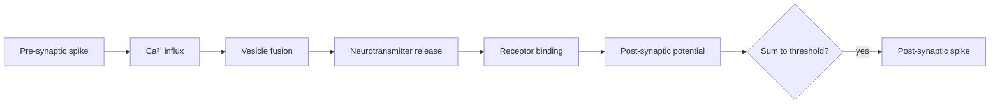

# Synapses, learning rules & plasticity

## The synapse in 60 seconds

A synapse is a junction where one neuron's axon terminal meets another neuron's dendrite. Spike arrives → calcium influx → vesicles fuse → neurotransmitter (glutamate / GABA / dopamine / etc.) crosses the cleft → binds receptors on the postsynaptic side → opens ion channels → changes postsynaptic voltage.



Two big receptor classes you should recognize:

- **AMPA** (fast, depolarizing, glutamate) — does the basic excitation.
- **NMDA** (voltage- and ligand-gated, calcium-permeable) — the **coincidence detector** required for most Hebbian learning.

## Hebb's rule, the founding myth of neural learning

> "Cells that fire together, wire together."  — paraphrasing [Hebb, 1949](https://pure.mpg.de/rest/items/item_2346268/component/file_2346267/content).

Mathematically: $\Delta w_{ij} = \eta \, x_i \, x_j$. The synapse from j to i strengthens when both are active.

This is unstable on its own (weights grow without bound). Real plasticity adds bounds, normalization, and competition (Oja's rule, BCM theory).

## STDP: spike-timing-dependent plasticity

Real synapses care about **timing**, not just coincidence. If the presynaptic spike precedes the postsynaptic spike by ~10 ms → potentiation (LTP). Reverse → depression (LTD).

📄 [Bi & Poo, 1998 — Synaptic Modifications in Cultured Hippocampal Neurons](https://www.jneurosci.org/content/18/24/10464) — the canonical STDP curve.

```
LTP   ___
       /\
      /  \____________________
   __/                        \___  LTD
                              \/
   <-- pre after post   pre before post -->
```

**🤖 AI-relevance.** STDP is local, asymmetric, and online. It is the closest biological analogue we have to a "learning rule," and it doesn't look like backprop. Whole subfields (e.g. surrogate-gradient SNNs, predictive-coding nets) try to bridge backprop ↔ STDP.

## LTP & LTD: the molecular substrate of memory

- **LTP** (long-term potentiation) — sustained increase in synaptic strength after high-frequency stimulation. Discovered by [Bliss & Lømo, 1973](https://www.ncbi.nlm.nih.gov/pmc/articles/PMC1350458/) in rabbit hippocampus. NMDA-dependent.
- **LTD** (long-term depression) — the inverse.
- **Late-LTP** requires protein synthesis → links plasticity to gene expression and the molecular machinery of memory consolidation.

## The plasticity zoo

| Mechanism | Scope | Time | AI analogue |
|---|---|---|---|
| Hebbian / STDP | Single synapse | ms–min | Local update |
| Homeostatic | Whole neuron | hours | Layer-norm, weight decay |
| Synaptic scaling | All synapses on a neuron | hours–days | Normalization |
| Heterosynaptic | Neighboring synapses | min | Competition |
| Neuromodulatory (3-factor) | Gated by dopamine/ACh/NA | s–min | Reward-modulated learning |
| Structural | Spine growth/pruning | days–years | Architecture search |

The **3-factor rule** is the bridge most AI people miss: $\Delta w = \eta \cdot \text{pre} \cdot \text{post} \cdot M$ where $M$ is a global modulatory signal (dopamine, ACh). It maps cleanly onto reward-gated learning and is how the brain plausibly does credit assignment without backprop. See [Frémaux & Gerstner, 2016](https://www.frontiersin.org/articles/10.3389/fncir.2015.00085/full).

## Why this matters for backprop

Backpropagation requires:
1. Symmetric weights (forward and backward must use the same W).
2. Non-local error signals (gradient through every layer).
3. Distinct phases (forward then backward).

Cortex appears to violate all three. The "biological plausibility" debate is mostly about which assumptions can be relaxed. Read [Lillicrap et al., 2020 — Backpropagation and the brain](https://arxiv.org/abs/2004.13316) — the field's clearest statement of the problem.

Candidate biologically-plausible alternatives (treated in Ch 19):
- Feedback alignment ([Lillicrap et al., 2016](https://arxiv.org/abs/1411.0247))
- Equilibrium propagation ([Scellier & Bengio, 2017](https://www.frontiersin.org/articles/10.3389/fncom.2017.00024/full))
- Predictive coding nets ([Whittington & Bogacz, 2017](https://www.ncbi.nlm.nih.gov/pmc/articles/PMC5467749/))
- Target propagation, Burstprop, Dendritic gating

## Catastrophic forgetting & continual learning

Plain neural nets forget old tasks when trained on new ones. The brain doesn't. Known mechanisms:

- **Synaptic consolidation** — important synapses become resistant to change. ML analogue: [Elastic Weight Consolidation, Kirkpatrick et al., 2017](https://arxiv.org/abs/1612.00796).
- **Replay** — hippocampus replays past episodes during sleep, training neocortex slowly. ML analogue: replay buffers.
- **Modular architectures** — different circuits for different skills.

**🤖 AI-relevance.** Continual learning is a row in the AGI gap table (Ch 01). Plasticity research is where the candidate solutions live.

## Sources

- Kandel ch 66–67 (cellular mechanisms of learning).
- [Magee & Grienberger, 2020 — Synaptic plasticity forms and functions](https://en.wikipedia.org/wiki/Synaptic_plasticity) — modern review.
- [Abbott & Nelson, 2000 — Synaptic plasticity: taming the beast](https://en.wikipedia.org/wiki/Synaptic_plasticity) — classic.
