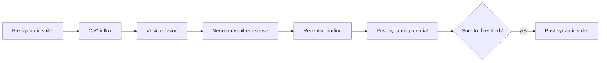

# Synapses, learning rules & plasticity

## The synapse in 60 seconds

A synapse is a junction where one neuron's axon terminal meets another neuron's dendrite. Spike arrives → calcium influx → vesicles fuse → neurotransmitter (glutamate / [GABA](https://en.wikipedia.org/wiki/Gamma-Aminobutyric_acid) / dopamine / etc.) crosses the cleft → binds receptors on the postsynaptic side → opens ion channels → changes postsynaptic voltage.



Two big receptor classes you should recognize:

- **AMPA** (fast, depolarizing, glutamate) — does the basic excitation.
- **NMDA** (voltage- and ligand-gated, calcium-permeable) — the **coincidence detector** required for most Hebbian learning.

## Hebb's rule, the founding myth of neural learning

> "Cells that fire together, wire together."  — paraphrasing [Hebb, 1949](https://pure.mpg.de/rest/items/item_2346268/component/file_2346267/content).

Mathematically: $\Delta w_{ij} = \eta \, x_i \, x_j$. The synapse from j to i strengthens when both are active.

This is unstable on its own (weights grow without bound). Real plasticity adds bounds, normalization, and competition (Oja's rule, BCM theory).

## STDP: spike-timing-dependent plasticity

Real synapses care about **timing**, not just coincidence. If the presynaptic spike precedes the postsynaptic spike by ~10 ms → potentiation (LTP). Reverse → depression (LTD).

📄 [Bi & Poo, 1998 — Synaptic Modifications in Cultured Hippocampal Neurons](https://www.jneurosci.org/content/18/24/10464) — the canonical STDP curve.

> Bi and Poo paired pre- and postsynaptic spikes at precisely controlled relative timings in cultured hippocampal neurons and measured the resulting change in synaptic strength. They obtained the now-canonical asymmetric STDP curve: pre-before-post pairings within ~20 ms produced potentiation (LTP), while post-before-pre pairings of similar magnitude produced depression (LTD). The effect fell off sharply with timing offsets beyond a few tens of milliseconds, demonstrating that biological synapses are sensitive to spike order at near-millisecond resolution. This established a concrete, biologically grounded learning rule whose mechanism was traceable to NMDA-receptor-dependent calcium dynamics. STDP became the canonical reference point for "local, online, asymmetric" plasticity rules in computational neuroscience and the foil against which biologically plausible alternatives to backpropagation are now compared.

```
LTP   ___
       /\
      /  \____________________
   __/                        \___  LTD
                              \/
   <-- pre after post   pre before post -->
```

**🤖 AI-relevance.** [STDP](https://en.wikipedia.org/wiki/Spike-timing-dependent_plasticity) is local, asymmetric, and online. It is the closest biological analogue we have to a "learning rule," and it doesn't look like backprop. Whole subfields (e.g. surrogate-gradient SNNs, predictive-coding nets) try to bridge backprop ↔ STDP.

## [LTP](https://en.wikipedia.org/wiki/Long-term_potentiation) & [LTD](https://en.wikipedia.org/wiki/Long-term_depression): the molecular substrate of memory

- **LTP** (long-term potentiation) — sustained increase in synaptic strength after high-frequency stimulation. Discovered by [Bliss & Lømo, 1973](https://www.ncbi.nlm.nih.gov/pmc/articles/PMC1350458/) in rabbit hippocampus. [NMDA](https://en.wikipedia.org/wiki/NMDA_receptor)-dependent.

  > Bliss and Lømo applied brief high-frequency electrical trains to perforant-path inputs in rabbit hippocampus and observed that the postsynaptic response remained enhanced for hours afterward — the first clear demonstration of long-term potentiation. The effect was input-specific, persistent, and required cooperative activation of converging fibers, satisfying the criteria for a Hebbian learning mechanism in real tissue. Subsequent work showed that LTP induction depends on NMDA receptors, which act as molecular coincidence detectors requiring simultaneous presynaptic glutamate release and postsynaptic depolarization. The paper is the empirical foundation for treating synaptic plasticity as the cellular substrate of learning and memory in the mammalian brain. It transformed memory research from a behavioral discipline into a molecular one and provided the biological grounding that computational learning rules — Hebbian, STDP, three-factor — all attempt to model.
- **LTD** (long-term depression) — the inverse.
- **Late-LTP** requires protein synthesis → links plasticity to gene expression and the molecular machinery of memory consolidation.

## The plasticity zoo

| Mechanism | Scope | Time | AI analogue |
|---|---|---|---|
| Hebbian / STDP | Single synapse | ms–min | Local update |
| Homeostatic | Whole neuron | hours | Layer-norm, weight decay |
| Synaptic scaling | All synapses on a neuron | hours–days | Normalization |
| Heterosynaptic | Neighboring synapses | min | Competition |
| Neuromodulatory (3-factor) | Gated by dopamine/[ACh](https://en.wikipedia.org/wiki/Acetylcholine)/NA | s–min | Reward-modulated learning |
| Structural | Spine growth/pruning | days–years | Architecture search |

The **3-factor rule** is the bridge most AI people miss: $\Delta w = \eta \cdot \text{pre} \cdot \text{post} \cdot M$ where $M$ is a global modulatory signal (dopamine, ACh). It maps cleanly onto reward-gated learning and is how the brain plausibly does credit assignment without backprop. See [Frémaux & Gerstner, 2016](https://www.frontiersin.org/articles/10.3389/fncir.2015.00085/full).

> Frémaux and Gerstner formalize the "three-factor" learning rule, in which synaptic weight changes depend not only on pre- and postsynaptic activity (the two Hebbian factors) but also on a third global modulatory signal carried by a neuromodulator like dopamine, acetylcholine, or noradrenaline. They show how eligibility traces — slow synaptic tags left by pre-post coincidence — can be retrospectively converted into weight changes when the third factor arrives, solving the temporal credit assignment problem that pure Hebbian rules cannot handle. The framework unifies reward-modulated STDP, policy-gradient methods, and actor-critic learning under a single biologically plausible umbrella. Three-factor rules approximate stochastic gradient descent in a local, online manner without requiring symmetric weights or backward error propagation. The paper is the central reference for biologically grounded credit assignment and underlies most modern proposals for brain-style continual learning and neuromorphic hardware.

## Why this matters for backprop

Backpropagation requires:
1. Symmetric weights (forward and backward must use the same W).
2. Non-local error signals (gradient through every layer).
3. Distinct phases (forward then backward).

Cortex appears to violate all three. The "biological plausibility" debate is mostly about which assumptions can be relaxed. Read [Lillicrap et al., 2020 — Backpropagation and the brain](https://arxiv.org/abs/2004.13316) — the field's clearest statement of the problem.

> Lillicrap, Santoro, Marris, Akerman & Hinton lay out why backpropagation looks biologically suspect — symmetric weights, distinct phases, non-local error signals — and survey the candidate mechanisms by which cortex might still implement an approximation of gradient-based credit assignment. They review feedback alignment, equilibrium propagation, predictive coding, target propagation, dendritic burstprop, and three-factor neuromodulated learning, assessing each against biological evidence and scaling behavior. Their synthesis is that cortex likely uses some local approximation to gradient descent, with apical dendrites carrying top-down signals and neuromodulators gating plasticity. The paper functions as the field's clearest statement of the credit-assignment problem and the standard reference for anyone working on biologically plausible learning. It also makes the practical point that beyond-backprop algorithms matter for neuromorphic hardware and on-device continual learning, not just for understanding cortex.

Candidate biologically-plausible alternatives (treated in Ch 19):
- Feedback alignment ([Lillicrap et al., 2016](https://arxiv.org/abs/1411.0247))
- Equilibrium propagation ([Scellier & Bengio, 2017](https://www.frontiersin.org/articles/10.3389/fncom.2017.00024/full))
- Predictive coding nets ([Whittington & Bogacz, 2017](https://www.ncbi.nlm.nih.gov/pmc/articles/PMC5467749/))
- Target propagation, Burstprop, Dendritic gating

## Catastrophic forgetting & continual learning

Plain neural nets forget old tasks when trained on new ones. The brain doesn't. Known mechanisms:

- **Synaptic consolidation** — important synapses become resistant to change. ML analogue: [Elastic Weight Consolidation, Kirkpatrick et al., 2017](https://arxiv.org/abs/1612.00796).

  > Kirkpatrick and colleagues at DeepMind introduced Elastic Weight Consolidation (EWC) as a continual-learning algorithm directly inspired by synaptic consolidation in biological brains. The core idea is to estimate the importance of each network weight to previously learned tasks using the diagonal of the Fisher information matrix, then add a quadratic penalty that pulls important weights toward their old values during new-task training. This implements a soft "memory" of past tasks without requiring the storage of past data, mirroring how biological synapses become biochemically resistant to change once they encode important memories. EWC reduced catastrophic forgetting on Atari and supervised benchmarks, although later work showed its effectiveness deteriorates over longer task sequences. The paper is the canonical example of a biology-inspired solution to continual learning and remains the standard baseline against which newer methods are compared.
- **Replay** — hippocampus replays past episodes during sleep, training neocortex slowly. ML analogue: replay buffers.
- **Modular architectures** — different circuits for different skills.

**🤖 AI-relevance.** Continual learning is a row in the [AGI](https://en.wikipedia.org/wiki/Artificial_general_intelligence) gap table (Ch 01). Plasticity research is where the candidate solutions live.

## Sources

- Kandel ch 66–67 (cellular mechanisms of learning).
- [Magee & Grienberger, 2020 — Synaptic plasticity forms and functions](https://doi.org/10.1146/annurev-neuro-090919-022842) — modern review.
- [Abbott & Nelson, 2000 — Synaptic plasticity: taming the beast](https://doi.org/10.1038/81453) — classic.
