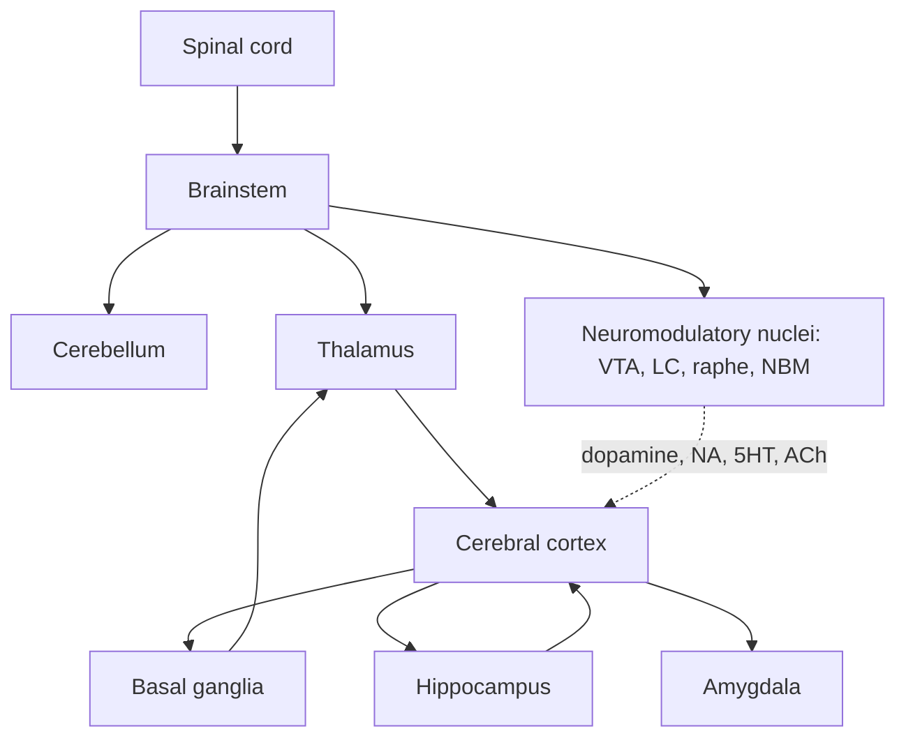
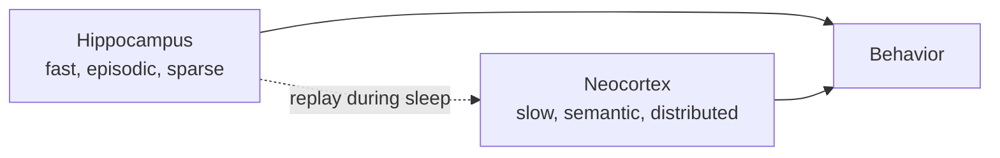

# Neuroanatomy: the systems-level map

You don't need anatomy to the level a med student does. You need the **functional block diagram** of the brain so that when a paper says "lesion to ventromedial PFC" or "hippocampal CA1 to entorhinal cortex" you can place it.

## The 60-second tour

## The cortex: where most "intelligence" lives

The cerebral cortex is a 2–4 mm thick sheet of ~16 billion neurons arranged in 6 layers, folded into gyri and sulci. Approx. organization:

- **Frontal lobe** — motor, planning, working memory, decision-making (PFC).
- **Parietal lobe** — spatial reasoning, attention, sensorimotor integration.
- **Temporal lobe** — auditory, language, object recognition (IT cortex), memory (hippocampus underneath).
- **Occipital lobe** — vision (V1, V2, V4, MT...).

### The 6 cortical layers

| Layer | Function (very rough) |
|---|---|
| L1 | Sparse, top-down feedback inputs |
| L2/3 | Cortico-cortical communication |
| L4 | Thalamic input — the "front door" |
| L5 | Output to subcortex (thick-tufted L5b → motor) |
| L6 | Output back to thalamus (corticothalamic loop) |

This stereotyped 6-layer microcircuit appears (with variations) across all neocortex. The hypothesis that **cortex runs one canonical algorithm everywhere** drives most neuro-AI work (Ch 15).

📄 [Mountcastle, 1997 — The columnar organization of the neocortex](https://en.wikipedia.org/wiki/Cortical_column) — the founding paper of canonical-cortex theory.

## The subcortical players you must know

| Structure | Function | AI mapping |
|---|---|---|
| **Thalamus** | Relay & gateway between cortex and world; every cortical area has its thalamic partner | Routing / attention gate |
| **Hippocampus** | Episodic memory, spatial cognition, replay | Memory + RL replay buffer (Ch 16) |
| **Amygdala** | Emotional valence, fear conditioning, salience | Reward shaping |
| **Basal ganglia** | Action selection, RL, habit | Actor-critic (Ch 09, 20) |
| **Cerebellum** | Forward models, fine motor, timing | Supervised online prediction (Ch 21) |
| **Brainstem** | Autonomic, arousal, sleep, neuromodulation | Hyperparameter controller |
| **Hypothalamus** | Drives, homeostasis, hormones | Goal generator |

## Neuromodulatory systems (the "global hyperparameter knobs")

Five small nuclei in the brainstem and basal forebrain project broadly to the rest of the brain and release a single neurotransmitter that **gates plasticity, gain, and global state**.

| System | Source | Transmitter | What it signals (rough) |
|---|---|---|---|
| Dopaminergic | VTA, SNc | Dopamine | Reward prediction error, motivation |
| Noradrenergic | Locus coeruleus | Noradrenaline | Surprise, arousal, network reset |
| Serotonergic | Raphe nuclei | Serotonin | Mood, time horizon, patience |
| Cholinergic | NBM, brainstem | Acetylcholine | Attention, signal-to-noise, plasticity gate |
| Histaminergic | Tuberomammillary | Histamine | Wakefulness |

**🤖 AI-relevance.** Read [Doya, 2002 — Metalearning and neuromodulation](https://en.wikipedia.org/wiki/Neuromodulation). Maps the four big neuromodulators to RL meta-parameters: dopamine ≈ TD error, serotonin ≈ discount γ, noradrenaline ≈ inverse temperature β, acetylcholine ≈ learning rate α. This is one of the cleanest neuro→AI mappings in the field.

## The two big learning systems hypothesis

A foundational simplification: the brain has at least two complementary memory systems.

📄 [McClelland, McNaughton & O'Reilly, 1995 — Why there are complementary learning systems](https://en.wikipedia.org/wiki/Catastrophic_interference) — the **CLS** (Complementary Learning Systems) framework. Direct ancestor of replay-buffer ideas in deep RL.

## Connectomes: the wiring diagram

- **C. elegans** — 302 neurons, fully mapped ([WormAtlas](https://www.wormatlas.org/)).
- **Drosophila** — 140k neurons, full hemibrain mapped ([FlyEM Hemibrain, 2020](https://www.janelia.org/project-team/flyem/hemibrain)) and now full female adult ([FlyWire, 2024](https://flywire.ai/)).
- **Mouse cortex** — 1 mm³ from MICrONS released 2025 ([microns-explorer.org](https://www.microns-explorer.org/)).
- **Human** — far away. ~86B neurons, ~10¹⁴ synapses.

**🤖 AI-relevance.** Connectomes give us hard structural constraints. Don't expect them to "explain" intelligence by themselves — knowing C. elegans's wiring did not give us C. elegans's behavior. But they are a substrate for hypothesis testing.

## Sources

- Kandel ch 16–17 for gross anatomy. Use the figures.
- [BrainFacts.org — Anatomy 101](https://www.brainfacts.org/) — public, accurate.
- [The Allen Brain Atlas](https://atlas.brain-map.org/) — interactive, gene-expression-aware.
