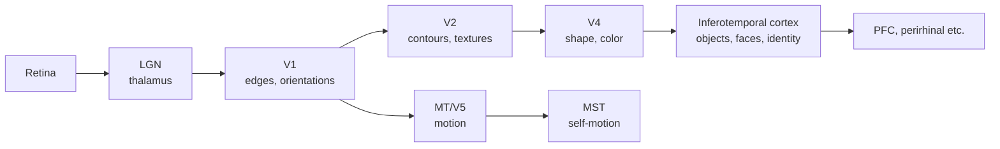
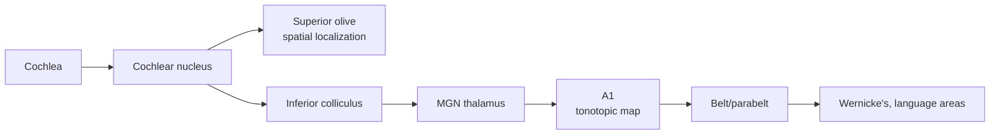

# Sensory systems: vision, audition, touch

## Why sensory systems are the easiest entry point for an AI person

We understand sensory cortex better than any other part of the brain. The **direct ancestor of CNNs is V1**. If you only deeply learn one bit of neuroanatomy, learn the visual system.

## The visual system: the canonical hierarchy

Two streams (Mishkin & Ungerleider, 1982):
- **Ventral stream** ("what") — V1 → V2 → V4 → IT — object recognition.
- **Dorsal stream** ("where/how") — V1 → MT → parietal — motion, action guidance.

### The Hubel & Wiesel result that started it all

📄 [Hubel & Wiesel, 1962 — Receptive fields, binocular interaction, and functional architecture in the cat's visual cortex](https://www.ncbi.nlm.nih.gov/pmc/articles/PMC1359523/). Nobel Prize 1981. They recorded from cat V1 and found:

- **Simple cells** respond to oriented edges at specific positions.
- **Complex cells** respond to oriented edges, more position-invariant.
- Cells are organized in columns by orientation preference.
- Hierarchy of increasing invariance and complexity.

This is a CNN. The architecture of LeCun's 1989 LeNet — local receptive fields, weight sharing, hierarchical pooling — is a direct biomimetic move from this paper. [Fukushima's 1980 Neocognitron](https://www.cs.princeton.edu/courses/archive/spr08/cos598B/Readings/Fukushima1980.pdf) was the first explicit implementation.

### V1 = Gabor filters (almost)

V1 simple cells are well-modeled as oriented Gabor filters. A trained CNN's first layer learns Gabor-like filters spontaneously. This is one of the field's most-cited convergences.

📄 [Olshausen & Field, 1996 — Emergence of simple-cell receptive field properties by learning a sparse code for natural images](https://www.rctn.org/bruno/papers/sparse-coding.pdf). Sparse coding on natural images yields V1-like Gabors. The earliest demonstration that **the brain's representations may follow from optimizing simple objectives on natural data**, not from hand-crafted biology.

### IT cortex ≈ trained CNN top layer

📄 [Yamins, Hong, Cadieu, Solomon, Seibert & DiCarlo, 2014 — Performance-optimized hierarchical models predict neural responses in higher visual cortex](https://www.pnas.org/doi/10.1073/pnas.1403112111). They found that the better a CNN performs at ImageNet, the better its top layers predict IT firing rates. **Task performance, not biological plausibility, predicts neural similarity.**

This is the field's strongest argument that scaling and task pressure recover brain-like representations. Whether it generalizes beyond ventral stream is unsolved.

**🤖 AI-relevance.** The vision/CNN convergence is the cleanest existing case study of "neural network solves the problem the way the brain does." Use it as your reference point. Then notice how poorly it generalizes — see Ch 22 for transformers, where the picture is messier.

### Adversarial examples and the gap

CNNs and human vision diverge on adversarial examples and texture-vs-shape bias. Humans use shape; CNNs heavily use texture ([Geirhos et al., 2019](https://arxiv.org/abs/1811.12231)). Robust models become more brain-like ([Engstrom et al., 2019](https://arxiv.org/abs/1906.00945)). The gap is informative.

## Audition: time, frequency, hierarchy

Cochlea is a **mechanical Fourier analyzer**: hair cells along the basilar membrane respond to different frequencies. A1 has a **tonotopic map** — adjacent neurons respond to adjacent frequencies, like a spectrogram laid on cortex.

**🤖 AI-relevance.** Audio ML uses spectrograms because the cochlea does the same thing. Wav2vec / HuBERT representations resemble auditory cortex hierarchy ([Millet et al., 2022](https://arxiv.org/abs/2206.01685)).

## Somatosensation & the homunculus

Touch maps onto **S1** in a topographic body map (the homunculus, Penfield 1937). Disproportionate cortex for hands, lips, tongue. Plastic — amputees can have face touches felt as the missing hand.

## Cross-modal & multimodal integration

The **superior colliculus** integrates vision, audition, touch into spatial maps for orientation. Higher cortical areas (e.g., STS) integrate face + voice. Multimodal integration is increasingly an AI frontier (CLIP, multimodal LLMs).

## Sensory coding principles to remember

1. **Topographic maps.** Adjacent stimuli → adjacent neurons. Holds for retinotopy, tonotopy, somatotopy.
2. **Hierarchy.** Receptive fields grow up the stack; invariance increases.
3. **Sparse coding.** Few neurons fire strongly; most stay quiet.
4. **Predictive coding.** Higher areas predict; lower areas signal residuals (Ch 13).
5. **Efficient coding.** [Barlow, 1961](https://en.wikipedia.org/wiki/Efficient_coding_hypothesis) — sensory cortex maximizes information about natural inputs subject to metabolic cost.

## Sources

- Kandel ch 25–28 for vision, 30–31 for audition.
- [DiCarlo, Zoccolan & Rust, 2012 — How does the brain solve visual object recognition?](https://www.ncbi.nlm.nih.gov/pmc/articles/PMC3306444/) — best modern review of ventral stream.
- [Brain-Score benchmark](https://www.brain-score.org/) — standard leaderboard for "how brain-like is your model on visual cortex."
