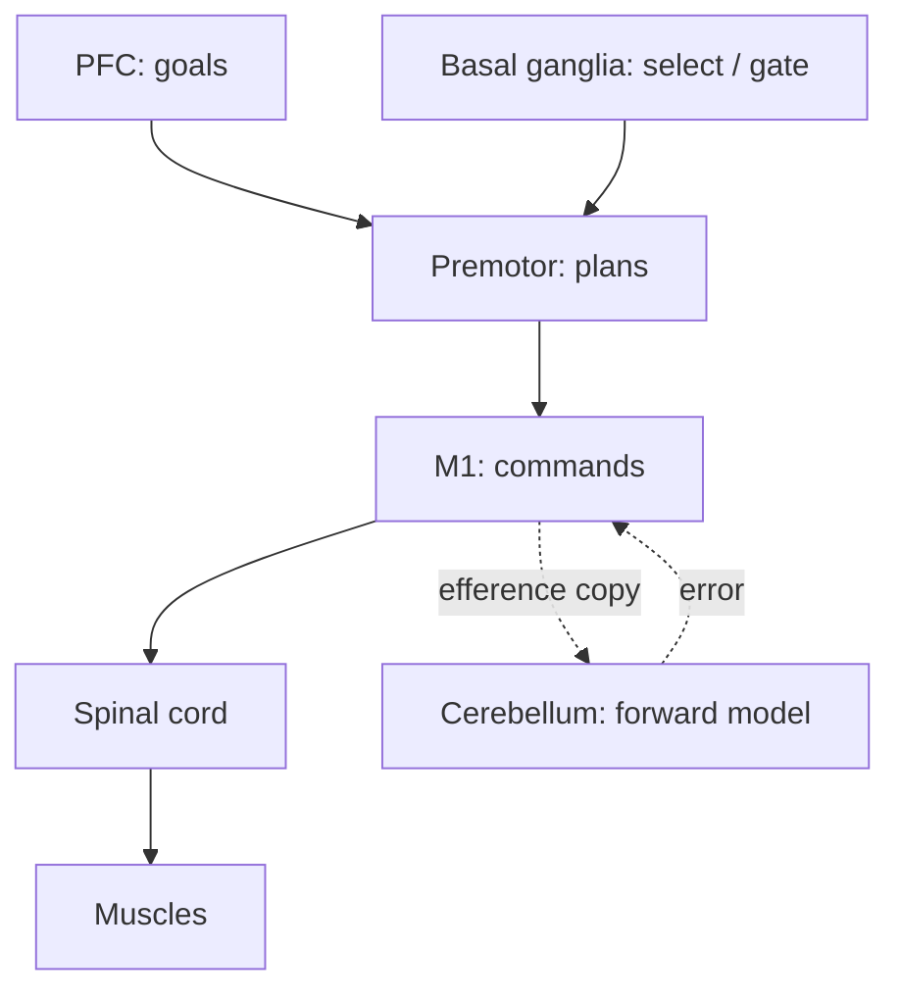

# Motor systems & action selection

## The motor stack

## Five things to remember

1. **Motor cortex is somatotopic** — hand area, leg area, etc. Same homunculus as [S1](https://en.wikipedia.org/wiki/Primary_somatosensory_cortex).
2. **The cerebellum is a forward model.** It predicts the sensory consequences of motor commands and computes errors. Deeply analogous to model-based [RL](https://en.wikipedia.org/wiki/Reinforcement_learning).
3. **Basal ganglia gate actions.** They select among competing plans via direct (Go) and indirect (No-Go) pathways modulated by dopamine.
4. **Spinal cord is not dumb.** Central pattern generators (CPGs) produce rhythmic locomotion without cortical input.
5. **Mirror neurons** in premotor cortex fire both when you act and when you watch someone else act ([Rizzolatti & Sinigaglia, 2010](https://doi.org/10.1038/nrn2805)). Hyped, but real.

## The cerebellum as a learning machine

📄 [Marr, 1969 — A theory of cerebellar cortex](https://www.ncbi.nlm.nih.gov/pmc/articles/PMC1351747/). The cerebellum has ~80% of the brain's neurons (granule cells), each receiving sparse, high-dimensional inputs. Marr proposed it learns supervised input-output mappings — and he was largely right. Climbing fibers from the inferior olive carry **error signals** that drive [LTD](https://en.wikipedia.org/wiki/Long-term_depression) at parallel-fiber → Purkinje synapses.

> David Marr proposed that the cerebellum is a learning machine in which the granule-cell layer projects mossy-fiber inputs into a vast, sparse, high-dimensional code that makes arbitrary input patterns linearly separable at the Purkinje cells. He hypothesized that climbing fibers from the inferior olive provide a teaching signal that selectively modifies parallel-fiber-to-Purkinje synapses, allowing the cerebellum to learn supervised input-output mappings. This recast the cerebellum from a passive coordination device into a generic supervised learner with explicit error-driven plasticity. Subsequent decades of physiology — long-term depression at parallel-fiber synapses, the role of climbing-fiber complex spikes — broadly vindicated Marr's framework, even as details were revised. The paper is one of the earliest examples of a Marr-style algorithmic theory that anticipated the structure of an artificial neural network: random expansion + linear readout + error-driven learning is the same recipe that powers extreme-learning machines and reservoir computing today.

Modern view: the cerebellum is a generic supervised learner used for motor control, timing, and (controversially) cognitive prediction.

**🤖 AI-relevance.** The cerebellum is a real, biological, three-layer feedforward network with a teacher signal. Closer to a textbook [ANN](https://en.wikipedia.org/wiki/Artificial_neural_network) than cortex is. See [Raymond & Medina, 2018](https://doi.org/10.1146/annurev-neuro-080317-061948).

## The basal ganglia as RL

The basal ganglia (striatum, GP, STN, SNc) implement **action selection via reinforcement learning**. Phasic dopamine from the substantia nigra and [VTA](https://en.wikipedia.org/wiki/Ventral_tegmental_area) delivers a TD-style reward prediction error to striatal medium spiny neurons. We will return to this in detail in Ch 09 and Ch 20.

Key reading: [Doya, 2000 — Complementary roles of basal ganglia and cerebellum in learning and motor control](https://doi.org/10.1016/S0959-4388(00)00153-7) — argues cerebellum = supervised, basal ganglia = RL, cortex = unsupervised. A strong organizing hypothesis even if oversimple.

## Forward, inverse, and internal models

- **Forward model.** Given action a and state s, predict next state s'. Implemented (largely) in cerebellum.
- **Inverse model.** Given desired s', compute action a. Implemented in motor cortex + basal ganglia + spinal cord.
- **Internal model** in general: the brain simulates outcomes before acting.

📄 [Wolpert, Ghahramani & Jordan, 1995 — An internal model for sensorimotor integration](https://doi.org/10.1126/science.7569931). Foundational.

**🤖 AI-relevance.** Model-based RL, Dreamer, Muzero, world-models — these are inverse and forward models. The brain version emphasizes (a) very fast learning, (b) tight coupling to control, (c) modularity per body part.

## Sources

- Kandel ch 33–37.
- [Shadmehr & Krakauer, 2008 — A computational neuroanatomy for motor control](https://doi.org/10.1007/s00221-008-1280-5) — bridges nicely to control theory.
