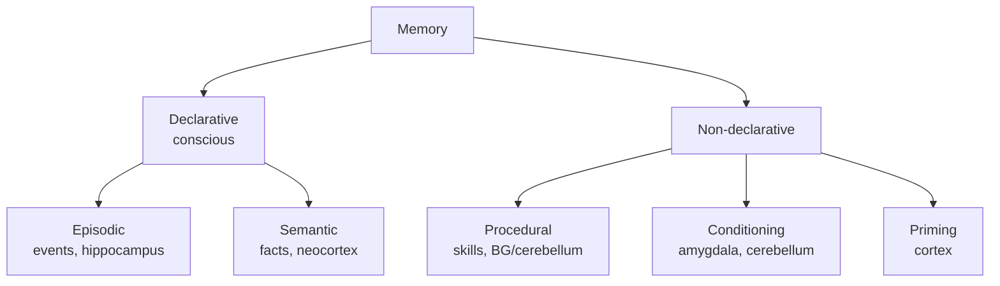
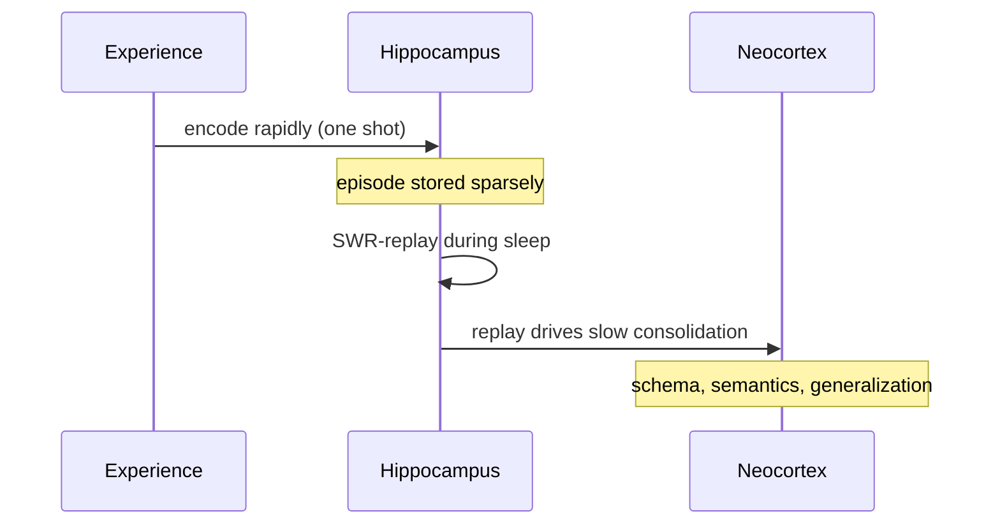

# Memory & the hippocampus

## Memory is not one thing

Different systems, different substrates, different rules. Damaging hippocampus knocks out new episodic memory but leaves procedural learning intact (the famous **patient HM**, [Scoville & Milner, 1957](https://www.ncbi.nlm.nih.gov/pmc/articles/PMC497229/)).

> Scoville and Milner reported the case of patient H.M., who underwent bilateral medial temporal lobe resection (including hippocampus) to treat severe epilepsy and emerged with a profound, permanent inability to form new declarative memories despite intact intelligence and personality. H.M. could carry on a conversation, perform on IQ tests, and learn new motor skills (procedural memory), but he could not consciously remember any new fact or event for more than a few minutes. The dissociation between his preserved short-term memory, preserved procedural learning, and abolished episodic memory provided the foundational evidence that memory is not a single system but a family of dissociable subsystems. The case established the hippocampus as essential for episodic and declarative learning while showing that procedural learning relies on different substrates (basal ganglia, cerebellum). It is the single most influential clinical case in the history of memory research and shapes every modern model of memory architecture, including AI memory designs that distinguish episodic from semantic stores.

## Working memory: held in mind, briefly

Persistent activity in **dorsolateral PFC** maintains items over seconds during a delay task. Capacity ~4 items in humans. [Goldman-Rakic, 1995](https://doi.org/10.1016/0896-6273(95)90304-6) is foundational; [Constantinidis et al., 2018](https://www.ncbi.nlm.nih.gov/pmc/articles/PMC6020047/) is the modern review.

**🤖 AI-relevance.** Transformer context windows are working-memory analogs; both are bottlenecked. Persistent attractor states in PFC offer one model of "register" memory that survives interference.

## Long-term memory: hippocampus + cortex via CLS

The **Complementary Learning Systems** framework (McClelland, McNaughton & O'Reilly, 1995):

- **Hippocampus** — fast, sparse, pattern-separating one-shot learner.
- **Neocortex** — slow, distributed, statistical generalizer.
- **Replay** during sleep transfers from hippocampus → cortex.

📄 [Kumaran, Hassabis & McClelland, 2016 — What learning systems do intelligent agents need?](https://www.ncbi.nlm.nih.gov/pmc/articles/PMC4920642/) — DeepMind's restatement, explicitly aimed at AI. **Required reading.**

> Kumaran, Hassabis, and McClelland revisit the Complementary Learning Systems framework two decades on and explicitly recast it as a design principle for AI agents. They argue any general intelligence needs both a slow statistical learner (akin to neocortex) for extracting regularities and a fast episodic store (akin to hippocampus) for one-shot encoding of specific experiences. They show that the hippocampus is more flexible than originally proposed — capable of supporting generalization through replay and inference, not merely retrieval — which expands the system's role beyond simple episodic memory. The paper directly motivates DeepMind's use of experience replay in DQN and points toward agents that interleave generative replay with continual updates to avoid catastrophic forgetting. It serves as the explicit bridge between cognitive-science memory theory and the engineering choices in modern deep reinforcement learning.

### Sharp-wave ripples and replay

During quiet wake and [NREM](https://en.wikipedia.org/wiki/Non-rapid_eye_movement_sleep) sleep, hippocampal [CA1](https://en.wikipedia.org/wiki/Hippocampus_anatomy) emits high-frequency (150–250 Hz) "sharp-wave ripples" during which sequences of place cells **replay** prior trajectories at 10–20× real time. This is the proposed substrate of consolidation and offline planning.

📄 [Foster & Wilson, 2006 — Reverse replay of behavioral sequences in hippocampal place cells during the awake state](https://doi.org/10.1038/nature04587) — the awake-replay paper.

> Foster and Wilson recorded place-cell activity in rat hippocampus and discovered that during brief pauses in active behavior — not just sleep — sequences of place cells reactivate in *reverse* order, replaying the trajectory the rat just traversed. This awake reverse replay occurred specifically at reward locations and was compressed roughly 20-fold compared to the original behavior. The finding extended replay beyond the sleep-only consolidation account and pointed toward online uses of replay — for credit assignment, planning, and value updating during behavior itself. Reverse replay is computationally well-suited for backward propagation of value information, exactly as TD-learning algorithms require. The paper is widely cited in deep RL as biological motivation for prioritized experience replay and for backward-style value updates during exploration.

📄 [Buzsáki, 2015 — Hippocampal sharp wave-ripple: a cognitive biomarker for episodic memory and planning](https://doi.org/10.1002/hipo.22488).

> Buzsáki reviews two decades of work on hippocampal sharp-wave ripples (SWRs), the 150–250 Hz oscillatory bursts during which place cells replay trajectories at compressed time scales. He synthesizes evidence that SWRs are not just consolidation events but also serve online planning, decision support, and even imagined trajectories the animal has never traversed. The paper proposes SWRs as a unified biomarker linking memory encoding, retrieval, planning, and offline learning, with disrupted ripples implicated in memory disorders. Crucially, ripples coordinate with cortical spindles and slow oscillations during sleep to drive hippocampus-to-neocortex transfer — the consolidation step at the heart of Complementary Learning Systems theory. The review is the standard reference for treating hippocampal replay as a substrate of both memory and prospective cognition, and it grounds the AI argument that current systems are missing an offline-replay-based consolidation mechanism.

**🤖 AI-relevance.** This is where DeepMind's [DQN paper (Mnih et al., 2015)](https://www.cs.toronto.edu/~vmnih/docs/dqn.pdf) directly cites neuroscience — experience replay was inspired by hippocampal replay. The [DQN](https://en.wikipedia.org/wiki/Q-learning) authors include Demis Hassabis, a hippocampus researcher by training.

## Place cells, grid cells, and the cognitive map

📄 [O'Keefe & Dostrovsky, 1971 — The hippocampus as a spatial map](https://doi.org/10.1016/0006-8993(71)90358-1). Place cells in CA1 fire when the animal is in a specific location.

> O'Keefe and Dostrovsky reported that individual neurons in rat hippocampal CA1 fire selectively when the animal occupies a specific location in its environment — what they called "place cells." Different cells code for different locations, collectively tiling the environment with overlapping place fields, and the population activity uniquely identifies position. The discovery transformed the hippocampus from an undifferentiated memory structure into a substrate for spatial cognition and a "cognitive map," validating Tolman's earlier behavioral hypothesis. Subsequent work showed place fields remap when the environment changes and reactivate during sleep, linking spatial coding to memory consolidation. The paper is one half of the work for which O'Keefe shared the 2014 Nobel Prize and is the empirical anchor for all later models of hippocampal function — from cognitive maps to successor representations to Tolman-Eichenbaum Machines.

📄 [Hafting et al., 2005 — Microstructure of a spatial map in the entorhinal cortex](https://doi.org/10.1038/nature03721). Grid cells fire on a hexagonal lattice covering the environment. Nobel Prize 2014 (O'Keefe, Mosers).

> Hafting and colleagues in the Moser lab discovered "grid cells" in rat medial entorhinal cortex — neurons whose firing fields tile the entire environment in a strikingly regular hexagonal lattice. Different grid cells share orientation and spacing within a module but vary in scale across modules, with module spacing increasing geometrically along the dorsal-ventral axis of MEC. The hexagonal pattern is intrinsic to the entorhinal circuit and arises spontaneously without any explicit hexagonal cue in the environment, suggesting an internal path-integration system. Combined with head-direction and border cells, grid cells provide the hippocampus with a metric scaffold for spatial coding, encoding position via population activity in a way that is robust, periodic, and decomposable. The discovery earned the Mosers a share of the 2014 Nobel Prize and inspired a wave of AI work — most notably Banino et al. (2018) — showing that grid-like representations emerge in artificial networks trained on path integration.

Modern view: the hippocampal-entorhinal system is a **general-purpose relational memory and inference engine**, not just a GPS. It encodes spatial **and** non-spatial relational structure.

📄 [Behrens et al., 2018 — What is a cognitive map?](https://doi.org/10.1016/j.neuron.2018.10.002) — the modern reframing.
📄 [Whittington et al., 2020 — The Tolman-Eichenbaum Machine (TEM)](https://doi.org/10.1016/j.cell.2020.10.024) — relates hippocampus to a generative model with structural priors.

**🤖 AI-relevance.** Grid cells are surprisingly close to **principal components of place fields** ([Stachenfeld, Botvinick & Gershman, 2017 — Hippocampus as a predictive map](https://doi.org/10.1038/nn.4650)). Successor representations bridge to [RL](https://en.wikipedia.org/wiki/Reinforcement_learning) (Ch 16, Ch 20). [Banino et al., 2018, Nature](https://doi.org/10.1038/s41586-018-0102-6) — agents trained on path integration spontaneously develop grid-like units.

## Sleep and consolidation

Sleep is when episodic → semantic transfer happens. Slow-wave sleep coordinates hippocampal ripples with cortical spindles and slow oscillations. [Diekelmann & Born, 2010 — The memory function of sleep](https://www.ncbi.nlm.nih.gov/pmc/articles/PMC3120218/).

**🤖 AI-relevance.** "AI doesn't sleep" is an argument that AI is missing offline consolidation. Continual-learning research that uses targeted replay or generative replay is taking this seriously.

## Sources

- Kandel ch 65–67.
- [Eichenbaum, 2017 — On the integration of space, time, and memory](https://www.ncbi.nlm.nih.gov/pmc/articles/PMC5538858/).
- [Buzsáki, Rhythms of the Brain (book)](https://en.wikipedia.org/wiki/Gy%C3%B6rgy_Buzs%C3%A1ki) — hugely influential.
