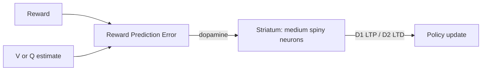

# Reward, dopamine & reinforcement learning

This chapter is the single tightest neuro→AI mapping in existence. If you read just one chapter outside Part IV, read this one.

## Schultz, Dayan & Montague (1997)

📄 [Schultz, Dayan & Montague, 1997 — A neural substrate of prediction and reward](https://www.gatsby.ucl.ac.uk/~dayan/papers/sdm97.pdf).

> Schultz recorded from midbrain dopamine neurons in monkeys performing Pavlovian conditioning, and Dayan and Montague showed that the firing patterns matched the temporal-difference (TD) prediction error from reinforcement-learning theory point for point. Unexpected rewards produced phasic dopamine bursts; rewards predicted by a learned cue did not, and the burst migrated backward in time onto the predictive cue itself; predicted rewards that were omitted produced a dip below baseline at the expected time. This match between a quantity defined in computer-science RL theory and a directly measured neural signal is one of the strongest convergences ever found between AI and neuroscience. It established the basal ganglia as a biological actor-critic system and gave reinforcement learning a clear neural substrate. Modern deep RL algorithms — A3C, PPO, SAC, AlphaZero — all retain the basic TD-error learning signal whose biological reality this paper established.

They recorded dopamine neurons in monkey [VTA](https://en.wikipedia.org/wiki/Ventral_tegmental_area) during a Pavlovian conditioning task. Three findings:

1. **Unexpected reward** → dopamine burst.
2. **Expected reward predicted by a cue** → no burst at reward; burst shifts to the cue.
3. **Predicted reward omitted** → dopamine **dip** at the expected time.

This is the temporal-difference ([TD](https://en.wikipedia.org/wiki/Temporal_difference_learning)) error from Sutton & Barto's [RL](https://en.wikipedia.org/wiki/Reinforcement_learning) textbook, **measured in the brain**. One of the most consequential results in neuroscience for AI.

```
  RPE = r + γ V(s') − V(s)
                  ↑
        dopamine phasic firing
```



## The basal ganglia as actor-critic

The dominant computational interpretation:

- **Striatum** = critic (state values).
- **Direct (D1) pathway** = "Go" — promotes selected action.
- **Indirect (D2) pathway** = "No-Go" — suppresses alternatives.
- **Dopamine** modulates plasticity: TD error trains both pathways.

Read: [Frank, 2005 — Dynamic dopamine modulation in the basal ganglia](https://doi.org/10.1162/0898929052880093).

**🤖 AI-relevance.** Actor-critic algorithms (A2C, A3C, SAC, [PPO](https://en.wikipedia.org/wiki/Proximal_policy_optimization)) are the closest computational framework we have to a working [BG](https://en.wikipedia.org/wiki/Basal_ganglia) model. The mapping is not loose — Schultz, Sutton, Barto, Doya, Dayan, Montague all crossed the bridge.

## Model-free vs model-based: the two RL systems

Behavioral data suggests animals (and humans) use both:

- **Model-free** — habit, fast, BG-driven. Cached values from past experience.
- **Model-based** — flexible, slow, hippocampus + dorsomedial [PFC](https://en.wikipedia.org/wiki/Prefrontal_cortex). Tree search through a learned model.

📄 [Daw, Niv & Dayan, 2005 — Uncertainty-based competition between prefrontal and dorsolateral striatal systems](https://www.princeton.edu/~ndaw/dnd05.pdf). Brain arbitrates between systems based on which one is more confident.

**🤖 AI-relevance.** Modern AI converges: AlphaZero uses model-based [MCTS](https://en.wikipedia.org/wiki/Monte_Carlo_tree_search) with model-free value learning. Dyna and successor representations bridge the two. The brain may be running a similar hybrid.

## Distributional RL in dopamine neurons

📄 [Dabney, Kurth-Nelson, Uchida, Starkweather, Hassabis, Munos & Botvinick, 2020 — A distributional code for value in dopamine-based reinforcement learning](https://arxiv.org/abs/1707.06887). DeepMind + Harvard. Different dopamine neurons have different optimism levels — they collectively encode the **distribution** of returns, not just the mean.

Distributional RL was proposed in ML first ([Bellemare, Dabney & Munos, 2017](https://arxiv.org/abs/1707.06887)). The neuro confirmation came later. **AI predicted neuroscience** here. This is rare and noteworthy.

## Curiosity, exploration & intrinsic motivation

The brain has multiple intrinsic reward signals:

- **Information gain / surprise** — dopamine bursts at novelty.
- **Competence / mastery** — likely cortical, less mapped.
- **Boredom** — a cost on stagnation.

📄 [Gottlieb & Oudeyer, 2018 — Towards a neuroscience of active sampling and curiosity](https://hal.archives-ouvertes.fr/hal-01976938/document). Bridges curiosity research in robotics ([Schmidhuber, 1991](http://people.idsia.ch/~juergen/curioussingapore/curioussingapore.html); [Pathak et al., 2017](https://arxiv.org/abs/1705.05363)) to neuroscience.

## Reward hacking, addiction, and the alignment metaphor

Drug addiction is a system where dopamine signals are decoupled from real reward. The brain's reward-prediction-error learner gets hijacked.

**🤖 AI-relevance.** This is the cleanest biological model of **reward hacking**. The brain has elaborate countermeasures (PFC inhibition, satiety signals, social context, long-horizon evaluation) and they sometimes fail. Alignment researchers should care.

## What dopamine does NOT do

Pop-science says "dopamine = pleasure." This is wrong in three ways:

1. Pleasure is encoded by **opioid hotspots** in NAc shell, not dopamine.
2. Dopamine signals **prediction error** and **incentive salience**, not reward itself.
3. Tonic dopamine signals **vigor / motivation** (Niv et al., 2007), not pleasure.

Read [Berridge & Robinson, 1998 — What is the role of dopamine in reward](https://doi.org/10.1016/S0165-0173(98)00019-8) to see the careful version.

## Sources

- Sutton & Barto 2nd ed., ch 1, 6, 14, 15. [Free PDF](http://incompleteideas.net/book/the-book-2nd.html).
- [Niv, 2009 — Reinforcement learning in the brain](https://www.princeton.edu/~yael/Publications/Niv2009.pdf) — best pedagogical review.
- [Dayan & Daw, 2008 — Decision theory, reinforcement learning, and the brain](https://doi.org/10.3758/CABN.8.4.429).
