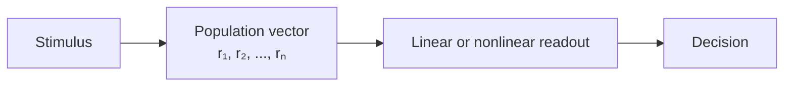

# Neural coding: rate, temporal, population

How does a brain represent information in neural activity? This is the **representation question** of neuroscience, and it has direct analogs to the embedding question in deep learning.

## Rate code

Information lives in **average firing rate** over some window (10–100 ms). Sufficient for many sensory and motor variables. The default model.

Limitation: requires averaging time, which the brain often doesn't have. A monkey can decide in 200 ms; that's barely 5–20 spikes.

## Temporal code

Information lives in **spike timing** — relative to other spikes, or to an external rhythm (theta phase, gamma cycle), or to stimulus onset.

📄 [Theunissen & Miller, 1995 — Temporal encoding in nervous systems](https://doi.org/10.1007/BF00961885). The criteria for "this is genuinely a temporal code, not just a fast rate code."

Examples:
- **Phase coding** in hippocampus: place cells fire at progressively earlier theta phases as the rat traverses the place field ("phase precession," [O'Keefe & Recce, 1993](https://doi.org/10.1002/hipo.450030307)).
- **Latency coding** in retina, auditory: first-spike latency carries stimulus identity.
- **Synchrony** as a binding mechanism (controversial; see [Singer, 1999](https://doi.org/10.1016/S0896-6273(00)80821-1)).

## Population code

Information is distributed across **many neurons**. No single neuron is decisive; the readout is a vector. This is what almost all modern NeuroAI assumes.

📄 [Pouget, Dayan & Zemel, 2000 — Information processing with population codes](https://doi.org/10.1038/35039062). Population codes naturally implement **probabilistic** representations — ideal for Bayesian inference (Ch 13).

> Pouget, Dayan, and Zemel argue that population codes — distributed patterns of activity across many neurons — naturally implement probabilistic representations rather than just point estimates of stimulus values. They show that the shape of a population's activity profile encodes uncertainty as well as the stimulus, with broader profiles representing wider posteriors. Crucially, simple operations on population activity — sums, products, normalization — can implement Bayes-optimal cue combination and probabilistic inference without explicit probability calculations. This makes population coding a strong candidate for how cortex performs Bayesian computation in a biologically realistic substrate. The framework anticipates "probabilistic population codes" and connects directly to modern variational inference and probabilistic programming approaches in machine learning, where distributions rather than point estimates drive computation.

Two flavors:
- **Localist / sparse.** A small set of neurons fire for a given stimulus. Strong evidence in hippocampus (place cells), grandmother-cell debates in IT.
- **Distributed / dense.** Most neurons participate; identity is in the pattern. Default in cortex. This is what deep learning embeddings are.

## Decoding: how we read out neural codes

Standard tools:
- **Linear decoders** (Wiener, logistic, linear SVM) — what is *linearly readable* from population activity.
- **Bayesian decoders** — invert encoding model, recover posterior over stimulus.
- **Neural network decoders** — closer to ML inversion.

Linear separability of a representation is the operational definition of "the brain knows X." Same idea as **probing** in interpretability.

**🤖 AI-relevance.** "Linear probes" in [LLM](https://en.wikipedia.org/wiki/Large_language_model) interpretability ([Belinkov, 2022](https://aclanthology.org/2022.cl-1.7/)) are the same construct as population decoders in neuroscience. Both communities are converging on similar methods. The neuro side is older and has better priors on what decoding shows and doesn't.

## Sparse coding & efficient coding

📄 [Olshausen & Field, 1996](https://www.rctn.org/bruno/papers/sparse-coding.pdf) — Already cited in Ch 5. Imposing sparsity on a generative model of natural images yields [V1](https://en.wikipedia.org/wiki/Visual_cortex)-like Gabor receptive fields.

> Olshausen and Field trained a linear generative model on patches of natural images under a single constraint — that only a small fraction of basis units should be active for any given image — and found that the optimal basis functions are oriented, localized, bandpass filters strikingly similar to V1 simple-cell receptive fields. This was the first clear demonstration that V1's signature representational properties can be derived from a simple objective applied to natural-image statistics, rather than hand-crafted into the architecture. The paper revived efficient-coding ideas tracing back to Barlow and reframed cortical representations as solutions to an optimization problem. Three decades later, sparse autoencoders descended directly from this work power LLM mechanistic interpretability at frontier AI labs. It is one of the most consequential single results in computational neuroscience and the cleanest example of a principle that travels both directions between brains and AI.

📄 [Barlow, 1961](https://doi.org/10.7551/mitpress/9780262518208.003.0011) — efficient-coding hypothesis: sensory cortex encodes natural inputs to maximize information per spike subject to metabolic cost.

**🤖 AI-relevance.** Sparse autoencoders (SAEs), the current leading interpretability tool for LLMs ([Anthropic 2024 — Towards Monosemanticity](https://transformer-circuits.pub/2024/scaling-monosemanticity/index.html)), implement exactly this principle on transformer activations. A 1996 neuroscience paper is now the dominant tool of LLM mechanistic interpretability.

## Neural manifolds

Population activity often lives on a low-dimensional curved subspace (a "manifold") of much lower rank than the number of neurons. Tasks impose geometry on these manifolds.

📄 [Gallego, Perich, Miller & Solla, 2017 — Neural manifolds for the control of movement](https://www.ncbi.nlm.nih.gov/pmc/articles/PMC5764179/).

> Gallego and colleagues review the central finding that simultaneously recorded population activity in motor cortex lives on a low-dimensional manifold whose dimensionality is far below the number of neurons but matches the number of behavioral degrees of freedom. They show that this neural manifold is preserved across days and across slightly different task variants, and that direct readouts from the manifold predict movement better than readouts from individual neurons. The framework reframes computation in motor cortex as living in the geometry of population trajectories rather than in single-neuron tuning. This perspective has since become standard not only in motor cortex but across PFC, hippocampus, and visual cortex, and has direct counterparts in mechanistic-interpretability work that frames LLM residual streams as living on task-relevant low-dimensional subspaces. The paper is the canonical entry point to neural-manifold thinking and the dimensionality-reduction methodology that supports it.

**🤖 AI-relevance.** Mechanistic interpretability work in LLMs is increasingly framing residual-stream activations as living on **task-relevant low-dim manifolds** that are linearly readable. Same methodology, different substrate.

## What's "in" a representation? The disentanglement question

A representation is **disentangled** if independent generative factors (object identity, pose, lighting) correspond to independent dimensions. Both fields care:

- ML: β-[VAE](https://en.wikipedia.org/wiki/Variational_autoencoder), diffusion latents, factor models.
- Neuro: face cells in macaque IT encode pose and identity in linearly separable subspaces ([Chang & Tsao, 2017](https://www.ncbi.nlm.nih.gov/pmc/articles/PMC5847289/)).

## Sources

- Dayan & Abbott chs 1–4 — single-neuron coding, population coding, decoding.
- [Quian Quiroga & Panzeri, 2009 — Extracting information from neuronal populations](https://doi.org/10.1038/nrn2578).
- [Brette, 2015 — Philosophy of the spike](https://www.frontiersin.org/articles/10.3389/fnsys.2015.00151/full) — provocative critique of the rate code.
