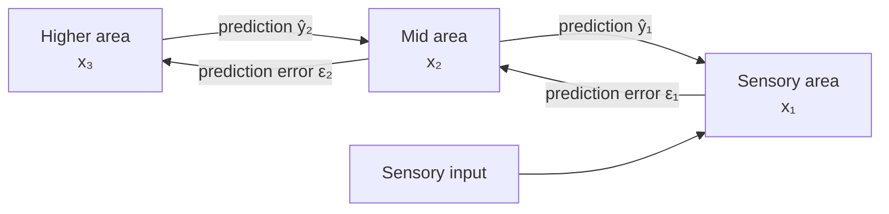

# The Bayesian brain & predictive coding

The single most important computational hypothesis in neuroscience for a modern AI researcher.

## The big claim

The brain treats perception, cognition, and action as **probabilistic inference**. It maintains a generative model of the world; sensory inputs are observations; behavior is the posterior-driven action.

$$P(\text{world} \mid \text{senses}) \propto P(\text{senses} \mid \text{world}) \, P(\text{world})$$

Implications:
- Perception is the brain's best guess given priors and evidence.
- Illusions, ambiguity resolution, prior-dependent perception are explained by Bayesian arithmetic.
- Action is sampling actions that lead to expected sensory consequences.

📄 [Knill & Pouget, 2004 — The Bayesian brain: the role of uncertainty in neural coding and computation](https://doi.org/10.1016/j.tins.2004.10.007). The field's manifesto.

## Cue integration: Bayesian to within ε

📄 [Ernst & Banks, 2002 — Humans integrate visual and haptic information in a statistically optimal fashion](https://doi.org/10.1038/415429a). When subjects judge object size from sight + touch, they weight the two cues by their relative reliability — exactly the Bayesian-optimal rule. Strong empirical support that humans **really do** Bayesian inference at the perceptual level.

## Predictive coding: the candidate cortical algorithm

📄 [Rao & Ballard, 1999 — Predictive coding in the visual cortex: a functional interpretation of some extra-classical receptive field effects](https://doi.org/10.1038/4580). The most-cited single computational theory of cortex.

**The architecture.** Each cortical layer:
1. Sends a **prediction** (top-down feedback) to the layer below.
2. Receives a **prediction error** (bottom-up) from the layer below.
3. Updates its own representation to reduce that error.

Predictions flow down. Errors flow up. The system minimizes total prediction error end to end. **Inference is iterative and local.**

**🤖 AI-relevance.** This is staggeringly important and under-appreciated in AI:

- Predictive coding can implement backprop with **local** rules ([Whittington & Bogacz, 2017](https://www.ncbi.nlm.nih.gov/pmc/articles/PMC5467749/); [Millidge, Tschantz & Buckley, 2022](https://arxiv.org/abs/2202.09467)).
- It naturally builds in uncertainty.
- Many self-supervised learning objectives ([BERT](https://en.wikipedia.org/wiki/BERT_(language_model))-style masked prediction, autoregressive next-token, [JEPA](https://ai.meta.com/blog/yann-lecun-advances-in-ai-research/)) are computationally **predictive coding**, just at a larger scale and with backprop.
- LeCun's [JEPA](https://openreview.net/pdf?id=BZ5a1r-kVsf) and his ["A Path Towards Autonomous Machine Intelligence" 2022](https://openreview.net/pdf?id=BZ5a1r-kVsf) explicitly invoke predictive coding's lineage.

## Where Bayesian-brain meets neural data

- Multisensory integration (Ernst & Banks above).
- Visual illusions explained by priors ([Adams, Graf & Ernst, 2004](https://doi.org/10.1038/nn1206)).
- Schizophrenia interpreted as miscalibrated priors ([Sterzer et al., 2018](https://doi.org/10.1016/j.biopsych.2018.05.015)).
- Place-cell and grid-cell activity as posterior over location.
- "End-stopping" and surround suppression in [V1](https://en.wikipedia.org/wiki/Visual_cortex) explained quantitatively by predictive coding (Rao & Ballard).

## Probabilistic population codes

How does a population of spiking neurons represent a distribution? Two leading proposals:

- **Probabilistic population codes (PPCs)** — Poisson-like population activity directly encodes a likelihood; multiplication of two cues = sum of population activities. [Ma, Beck, Latham & Pouget, 2006](https://doi.org/10.1038/nn1790).
- **Sampling-based codes** — neural variability **is** sampling from the posterior. [Hoyer & Hyvärinen, 2003](https://en.wikipedia.org/wiki/Bayesian_approaches_to_brain_function); [Fiser, Berkes, Orbán & Lengyel, 2010](https://www.ncbi.nlm.nih.gov/pmc/articles/PMC2904966/).

**🤖 AI-relevance.** Both ideas have parallels in ML — variational inference (≈ [PPC](https://en.wikipedia.org/wiki/Population_coding)) and Monte Carlo / diffusion (≈ sampling code). The neuro choice between them is unresolved.

## The "binding by predictive coding" idea

How do separate features (color, shape, motion, identity) bind into one object? Predictive coding offers a candidate: the object is the latent variable whose predictions best explain co-occurring features. Not yet conclusively shown but intellectually clean.

## Sources

- [Friston, 2005 — A theory of cortical responses](https://royalsocietypublishing.org/doi/10.1098/rstb.2005.1622) — predictive-coding-as-cortical-algorithm in Friston's variational framing.
- [Spratling, 2017 — A review of predictive coding algorithms](https://doi.org/10.1016/j.bandc.2015.11.003).
- [Clark, A., 2013 — Whatever next? Predictive brains, situated agents, and the future of cognitive science](https://doi.org/10.1017/S0140525X12000477).
- [Hohwy, J. — The Predictive Mind (book, 2013)](https://en.wikipedia.org/wiki/Predictive_coding).
