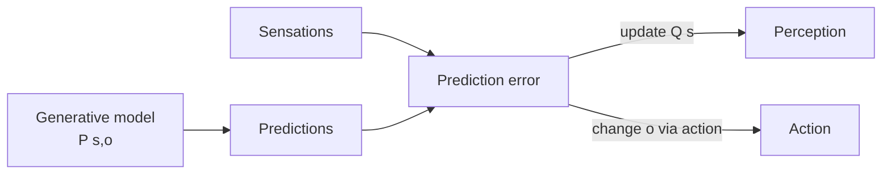

# Free Energy Principle & active inference

Karl Friston's grand unified theory of self-organizing systems. Polarizing — to some it's the deepest framework in cognitive science; to others it's untestable. You should know it because the most ambitious neuro-AI proposals (e.g., Yann LeCun's autonomous-machine-intelligence) live in its conceptual neighborhood.

## The one-line claim

Any self-organizing system that resists dissipation must, on average, **minimize variational free energy** — equivalently, minimize surprise about its sensory inputs.

$$F = -\log P(o) + \text{[KL](https://en.wikipedia.org/wiki/Kullback%E2%80%93Leibler_divergence)}\left[Q(s) \, \| \, P(s|o)\right]$$

Where $o$ are observations, $s$ are hidden world states, $P$ is the generative model, $Q$ is the brain's approximate posterior. **F is an upper bound on surprise** — minimizing it minimizes surprise.

## Why this matters even if you don't buy the metaphysics

The math reduces to standard variational inference, the same machinery behind VAEs and modern Bayesian deep learning. What's distinctive is **active inference**: the agent can also minimize free energy by **changing its inputs** — i.e., **acting**.

**Perception** = update beliefs to fit observations.
**Action** = change observations to fit beliefs.
Both reduce the same loss.

## Active inference

📄 [Friston, 2010 — The free-energy principle: a unified brain theory?](https://www.fil.ion.ucl.ac.uk/~karl/The%20free-energy%20principle%20A%20unified%20brain%20theory.pdf). The accessible version.
📄 [Friston, FitzGerald, Rigoli, Schwartenbeck & Pezzulo, 2017 — Active inference: a process theory](https://doi.org/10.1162/NECO_a_00912). The mechanistic version.

In active inference, agents have **prior preferences** over observations (e.g., "stay alive," "be in homeostatic ranges"). Behavior is whatever minimizes expected free energy over future trajectories. This collapses perception, learning, planning, and exploration into one objective.

**🤖 AI-relevance.** Maps in interesting ways to:

- **Reinforcement learning.** Expected free energy decomposes into an exploitation term (KL between predicted and preferred outcomes) and an exploration term (epistemic information gain). [RL](https://en.wikipedia.org/wiki/Reinforcement_learning) + curiosity in one principled framework.
- **World models.** The generative model is exactly Sutton-style or Ha-Schmidhuber-style world models, with a Bayesian formalism on top.
- **LeCun's H-[JEPA](https://ai.meta.com/blog/yann-lecun-advances-in-ai-research/) / autonomous machine intelligence.** A predictive-coding-meets-energy-based-models proposal that has a great deal of family resemblance to active inference, even though LeCun explicitly distances himself from [FEP](https://en.wikipedia.org/wiki/Free_energy_principle) rhetoric.

## What FEP critics say

- It's vacuous: any system that persists can be redescribed as minimizing some free energy. Predictive content is therefore weak.
- It conflates physical, normative, and inferential claims.
- See [Colombo & Wright, 2018](https://doi.org/10.1007/s11229-018-01932-w).

The honest synthesis: as a **practical framework** for building agents (active inference algorithms), it is generative and useful. As a **physics theorem about life**, treat with caution.

## Useful working concepts taken from FEP

- **Markov blanket** — partition of state into internal, blanket (sensory + active), external. Useful for thinking about agent boundaries. [Kirchhoff et al., 2018](https://royalsocietypublishing.org/doi/10.1098/rsif.2017.0792).
- **Epistemic value** — actions that reduce uncertainty (information gain) are inherently rewarding. Maps to curiosity-driven RL.
- **Pragmatic value** — actions that achieve preferred outcomes. Maps to standard RL.

## Sources

- [Parr, Pezzulo & Friston, 2022 — Active Inference (book, MIT Press, free PDF)](https://direct.mit.edu/books/oa-monograph/5299/Active-InferenceThe-Free-Energy-Principle-in-Mind) — the canonical textbook.
- [Da Costa et al., 2020 — Active inference on discrete state-spaces](https://arxiv.org/abs/2001.07203) — readable formal exposition.
- [Sajid, Ball, Parr & Friston, 2021 — Active inference: demystified and compared](https://arxiv.org/abs/1909.10863) — bridges to RL.
