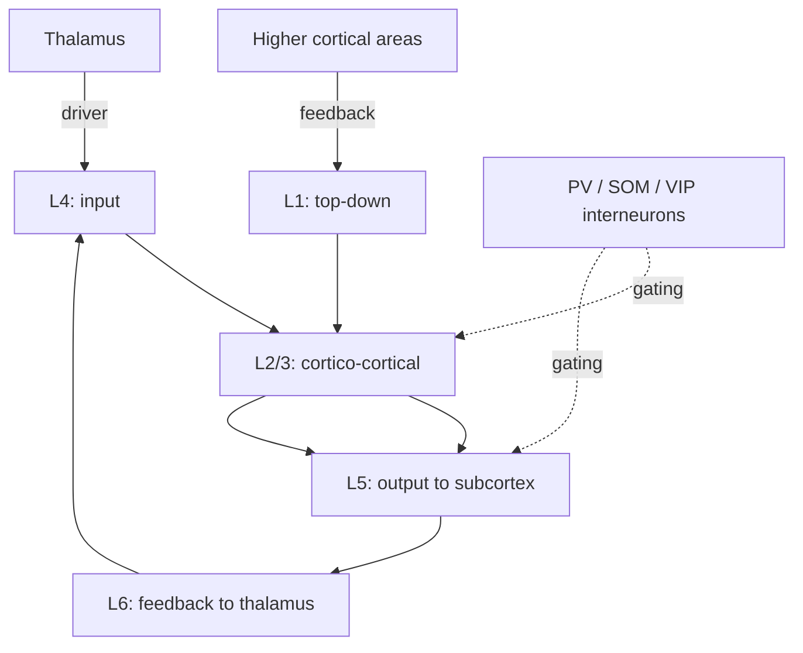

# The cortical microcircuit & canonical computation

## The bet that drives modern NeuroAI

Cortex is a **6-layer cake** that looks roughly the same everywhere — [V1](https://en.wikipedia.org/wiki/Visual_cortex), [M1](https://en.wikipedia.org/wiki/Primary_motor_cortex), [PFC](https://en.wikipedia.org/wiki/Prefrontal_cortex), [A1](https://en.wikipedia.org/wiki/Auditory_cortex). The bet: there is one **canonical algorithm** instantiated by this microcircuit, and learning it is the central problem.

This is the cortical analog of the bitter lesson: don't model V1 differently from M1 differently from IT. Model the canonical circuit; let task and input shape the rest.

📄 [Mountcastle, 1997 — The columnar organization of the neocortex](https://doi.org/10.1093/brain/120.4.701).
📄 [Douglas & Martin, 2004 — Neuronal circuits of the neocortex](https://doi.org/10.1146/annurev.neuro.27.070203.144152). Best summary of the canonical-microcircuit hypothesis.

> Douglas and Martin synthesized decades of anatomical and physiological data into the canonical-microcircuit hypothesis: a stereotyped six-layer wiring pattern that, with minor variations, recurs across all of neocortex. Thalamic input enters at layer 4, propagates upward to layers 2/3 for cortico-cortical communication, then to layer 5 for output to subcortical targets, while layer 6 closes the corticothalamic feedback loop. The circuit features strong recurrent excitation among pyramidal cells balanced by fast local inhibition from interneuron classes that gate gain, timing, and plasticity. Their central claim is that despite vast functional differences between V1, M1, A1, and PFC, the underlying circuit blueprint is essentially the same — implying one canonical algorithm that learning and input shape into different specialties. This "one-algorithm" hypothesis is the central bet of much modern NeuroAI, motivating attempts to identify a single learning rule (predictive coding, sparse coding, attractor dynamics) that the cortex executes everywhere.

## The wiring (rough)

Repeated across **square millimeters** of cortex with local variations. The columnar idea: a vertical "column" through these layers is a computational unit. Empirically, columns are softer than originally claimed but the rough vertical organization holds.

## What the canonical circuit might be doing

Several leading hypotheses, mostly compatible:

1. **Predictive coding.** L2/3 carries predictions, L4/L5 errors. [Bastos et al., 2012](https://www.ncbi.nlm.nih.gov/pmc/articles/PMC3526980/) — a full canonical-microcircuit proposal for predictive coding.
2. **Hierarchical Bayesian inference.** Each column infers the local posterior; feedback carries the prior. [Lee & Mumford, 2003](https://doi.org/10.1364/JOSAA.20.001434).
3. **Sparse distributed coding** with competitive lateral inhibition. [Olshausen-style models](https://www.rctn.org/bruno/papers/sparse-coding.pdf).
4. **Cortical "Hebbian assemblies"** — Hebb's cell assemblies as the unit. Related to Hopfield-style attractors. [Buzsáki, 2010](https://doi.org/10.1016/j.neuron.2010.09.023).

## Numenta and the Thousand Brains theory

Jeff Hawkins' lab argues each cortical column is itself a **complete model of the world** that votes with other columns. Provocative; under-validated; probably wrong in detail; useful as a thought experiment.

📄 [Hawkins, Lewis, Klukas, Purdy & Ahmad, 2019 — A framework for intelligence and cortical function based on grid cells in the neocortex](https://www.frontiersin.org/articles/10.3389/fncir.2018.00121/full). Read once. Don't bet your career on it.

**🤖 AI-relevance.** The Numenta framing — "many small models that vote, share representations via reference frames, encode object structure relationally" — has clear analogies in mixture-of-experts LLMs and capsule networks. Whether the analogy is causal is unclear.

## Interneurons: the gating cast

Three big inhibitory subtypes, each with a structural role:

| Cell | Targets | Role |
|---|---|---|
| **[PV](https://en.wikipedia.org/wiki/Parvalbumin)+ basket cells** | Pyramidal somas | Fast, blanket inhibition; gain control; gamma rhythm generation |
| **SOM+ Martinotti cells** | Pyramidal dendrites | Local, dendrite-targeting; gates feedback |
| **[VIP](https://en.wikipedia.org/wiki/Vasoactive_intestinal_peptide)+** | SOM and other inhibitory cells | **Disinhibitory** — gates SOM off, opens dendrites to top-down |

The PV–SOM–VIP triad is the canonical "context-dependent computation" circuit. Top-down and neuromodulatory inputs typically arrive on VIP cells, which release SOM, which opens dendritic inputs. Effective gating without explicit multiplications.

📄 [Karnani, Agetsuma & Yuste, 2014](https://doi.org/10.1016/j.conb.2014.02.014) — review of the disinhibitory motif.

**🤖 AI-relevance.** Gating is everywhere in modern AI — LSTMs, GRUs, gated MLPs, mixture-of-experts. The cortical version is multiplicative gating built from a network of inhibitory subtypes. Ideas like [Mixture-of-Experts routing](https://arxiv.org/abs/1701.06538) are loose biological cousins.

## Cortical hierarchies and the Felleman-Van Essen diagram

📄 [Felleman & Van Essen, 1991 — Distributed hierarchical processing in the primate cerebral cortex](https://doi.org/10.1093/cercor/1.1.1). The famous spaghetti diagram of macaque visual cortex with ~30 areas in a partial hierarchy. Sets the data many cortical models try to match.

## Sources

- Kandel ch 17, ch 56.
- [Harris & Shepherd, 2015 — The neocortical circuit: themes and variations](https://www.ncbi.nlm.nih.gov/pmc/articles/PMC4419492/).
- [Bastos et al., 2012](https://www.ncbi.nlm.nih.gov/pmc/articles/PMC3526980/) (cited above) for the predictive-coding-microcircuit synthesis.
