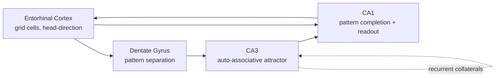

# Hippocampal computation: place cells, replay, successor representations

The hippocampus is the most computationally **legible** part of the brain — beautiful single-cell tunings, identifiable circuit motifs, clean theory. It is also where the strongest brain↔AI bridges have been built (CLS, replay, grid codes, successor representations).

## The macro-circuit: a 3-step loop

Each subregion has a clear computational reading:

| Region | Function | ML analogue |
|---|---|---|
| **DG** | Sparse high-dim expansion; pattern separation | Random projections / hashing |
| **CA3** | Recurrent attractor; auto-associative recall | Hopfield network |
| **CA1** | Mismatch / novelty detector; main output | Comparator / decoder |
| **EC** | Spatial + non-spatial relational scaffold (grid cells) | Position embedding |

📄 [Marr, 1971 — Simple memory: a theory for archicortex](https://royalsocietypublishing.org/doi/10.1098/rstb.1971.0078). David Marr did this in 1971, before computers were common. He was right about the auto-associative role of CA3.

## Place cells & cognitive maps

Place cells in CA1 fire at specific locations in an environment. They remap when the environment changes. They reactivate during sleep, replaying past trajectories.

📄 [O'Keefe & Nadel, 1978 — The Hippocampus as a Cognitive Map (book)](https://en.wikipedia.org/wiki/Cognitive_map) — the founding text.

## Grid cells & the entorhinal scaffold

Grid cells in medial entorhinal cortex fire on a hexagonal lattice. Multiple grid scales from medial to lateral. Combined with head-direction and border cells, they constitute a **path-integration system** that the hippocampus reads out.

📄 [Hafting, Fyhn, Molden, Moser & Moser, 2005](https://en.wikipedia.org/wiki/Grid_cell) — discovered them. Nobel 2014.

📄 [Banino et al., 2018 — Vector-based navigation using grid-like representations in artificial agents](https://en.wikipedia.org/wiki/Grid_cell). Train an agent on path integration with a generic RNN; grid-like units emerge. **AI predicts neuro again.**

## Successor representations: the Rosetta stone

A representation of state $s$ as the **expected discounted future occupancy** of all other states under the current policy:

$$M(s, s') = \mathbb{E}\left[\sum_{t=0}^\infty \gamma^t \mathbb{1}(s_t = s') \mid s_0 = s\right]$$

📄 [Dayan, 1993 — Improving generalization for temporal difference learning: the successor representation](https://en.wikipedia.org/wiki/Reinforcement_learning). Originally an RL idea.

📄 [Stachenfeld, Botvinick & Gershman, 2017 — The hippocampus as a predictive map](https://en.wikipedia.org/wiki/Hippocampus). Place cells **are** rows of the SR matrix; **grid cells are its eigenvectors**. One of the cleanest unifying results in the field.

**🤖 AI-relevance.** Successor features and successor representations are an active area in deep RL ([Barreto et al., 2017](https://arxiv.org/abs/1606.05312)). They give you transferable value functions across reward changes. The neuro story is that the brain may implement them directly.

## Replay: the bridge to model-based RL

Hippocampal sharp-wave ripples reactivate trajectories — forward, reverse, even unobserved (shortcut) trajectories. This looks computationally like:

- **Experience replay** (DQN-style).
- **Planning** (Dyna-style, MCTS-style backups).
- **Generative simulation** (rollout of imagined futures).

📄 [Mattar & Daw, 2018 — Prioritized memory access explains planning and hippocampal replay](https://www.princeton.edu/~ndaw/md18.pdf). Replay statistics are well-fit by **prioritized sweeping** — the brain replays experiences whose updates have the most expected value. Tight neuro→ML mapping.

📄 [Wittkuhn, Krippner, Koch & Schuck, 2024 — Replay in humans during fast offline planning](https://en.wikipedia.org/wiki/Hippocampal_replay) — fast (~50 ms) sequential reactivation in humans during decision-making.

## Tolman-Eichenbaum Machine (TEM)

📄 [Whittington, Muller, Mark, Chen, Barry, Burgess & Behrens, 2020 — The Tolman-Eichenbaum Machine: unifying space and relational memory through generalization in the hippocampal formation](https://en.wikipedia.org/wiki/Hippocampus#Models_of_hippocampal_function). A neural network model that derives place cells, grid cells, and relational generalization from a single self-supervised objective. Pure NeuroAI: explicitly designed to explain neural data and to compute non-trivially.

**🤖 AI-relevance.** TEM and successor-representation models are one of the most active interfaces between neuroscience and AI right now, and a great research topic for someone like you.

## What this all might mean for AI

If hippocampus is a:
- **Sparse memory store** (DG/CA3),
- **Pattern completion engine** (CA3),
- **Predictive map** (entorhinal SR),
- **Replay engine** for offline learning and planning (CA3 ripples),

then "AI is missing a hippocampus" is a coherent claim. Modern memory-augmented architectures (Memformer, MemGPT, retrieval-augmented LLMs, [Titans](https://arxiv.org/abs/2501.00663)) are step-zero attempts. None of them yet implement targeted, prioritized, generative replay during downtime.

## Sources

- [Behrens et al., 2018](https://en.wikipedia.org/wiki/Cognitive_map) — modern review.
- [Eichenbaum, 2017](https://www.ncbi.nlm.nih.gov/pmc/articles/PMC5538858/) — modern memory review.
- [Stachenfeld lab and Behrens lab papers](https://en.wikipedia.org/wiki/Hippocampus) — the most active groups in this niche.
