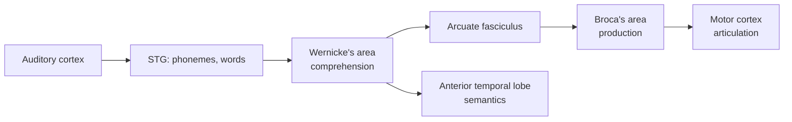

# LLMs, language & the cognitive sciences

## What LLMs are, by neuroscience standards

A frontier LLM is:
- A massive distributed associative memory.
- Trained primarily by self-supervised next-token prediction on broad text + multimodal data, then RL'd.
- Capable of **in-context learning**, **chain-of-thought reasoning**, **tool use**, **multi-turn agency**.
- Not embodied. Not continually learning. No long-term memory beyond context.

Compared to the human language faculty, this is at once enormously more (scale, breadth, languages) and crucially less (grounding, embodiment, long-horizon goal pursuit).

## Language in the brain: 90 seconds

Modern view ([Hagoort, 2016](https://en.wikipedia.org/wiki/Broca%27s_area); [Fedorenko, Ivanova & Regev, 2024](https://en.wikipedia.org/wiki/Language_module)):

- **Language network** is fronto-temporal, left-lateralized in most people.
- Specialized — clearly dissociable from general reasoning, math, music, theory of mind.
- **Selective**: brain damage can leave reasoning intact while abolishing language.

📄 [Fedorenko, Ivanova & Regev, 2024 — The language network as a natural kind within the broader landscape of the human brain](https://en.wikipedia.org/wiki/Language_module). Required reading. Argues the language network is for **communication**, not thought.

This is consequential for AI: if language is a communication interface, then a system trained only on language is missing whatever else thought consists of — perception, action, motivation, memory beyond context. **LLMs may be very good at the linguistic interface to cognition while missing what cognition is.** This is the strongest contemporary case for caution about LLM-as-AGI.

## LLMs as models of language cortex

📄 [Schrimpf et al., 2021](https://www.pnas.org/doi/10.1073/pnas.2105646118) — already cited. LMs predict language cortex.
📄 [Caucheteux & King, 2022](https://www.nature.com/articles/s42003-022-03036-1) — confirms.
📄 [Antonello, Vaidya & Huth, 2023 — Scaling laws for language encoding models in fMRI](https://arxiv.org/abs/2305.11863) — bigger LMs predict cortex better, with scaling laws of their own.

**🤖 AI-relevance.** LMs are the strongest models of language cortex we have ever had. This is real and noteworthy. It does NOT mean cortex implements a transformer; it means whatever cortex computes for language belongs to the same representational family as a trained next-token predictor.

## Language in LLMs vs language in humans

| | Humans | LLMs |
|---|---|---|
| Sample-efficiency | ~10⁸ words by age 10 | ~10¹³ tokens |
| Grounding | Embodied, multimodal, social | Text + some multimodal |
| Recursion | Robust | Robust on short, brittle on long |
| Theory of mind | Robust by age 4 | Behavioral evidence; mechanism unclear |
| Compositional generalization | Robust | Brittle, improving |
| Productive novelty | Routine | Surface-level; unclear in deep cases |
| Continual update | Routine | Frozen between training runs |

📄 [Lake & Murphy, 2023 — Word meaning in minds and machines](https://arxiv.org/abs/2008.01766).
📄 [Mitchell & Krakauer, 2023 — The debate over understanding in AI's large language models](https://arxiv.org/abs/2210.13966).

## Theory of mind in LLMs

📄 [Kosinski, 2024 — Evaluating large language models in theory of mind tasks](https://arxiv.org/abs/2302.02083). LLMs pass classic false-belief tasks at GPT-4 level.
📄 [Ullman, 2023 — Large Language Models Fail on Trivial Alterations to Theory-of-Mind Tasks](https://arxiv.org/abs/2302.08399). Same tasks slightly perturbed → failure. Shows LLM ToM is fragile.

This is a great microcosm of the LLM-as-cognition debate. Both citations true.

## Cognitive scientists using LLMs as models

LLMs are increasingly used as **subjects** in cognitive science experiments — replacing or supplementing humans in tasks where you want a quick pilot, generate predictions, or explore architecture-mediated behavior.

📄 [Binz & Schulz, 2023 — Using cognitive psychology to understand GPT-3](https://www.pnas.org/doi/10.1073/pnas.2218523120).
📄 [Binz et al., 2024 — Centaur: a foundation model of human cognition](https://arxiv.org/abs/2410.20268). LLM fine-tuned on human behavioral data to act as a general cognitive model.

This is a real new methodology in cognitive science.

## The hard part: meaning, grounding, and reference

LLMs are pre-trained on text. Words refer to things in a world LLMs do not directly inhabit. Whether this matters is contested:

- **Grounding required** ([Bender & Koller, 2020 — Climbing towards NLU](https://aclanthology.org/2020.acl-main.463/)): meaning requires connection to non-linguistic referents. LLMs miss this constitutively.
- **Grounding emergent** ([Pavlick, 2023](https://royalsocietypublishing.org/doi/10.1098/rsta.2022.0041)): textual structure carries enough about the world that meaning can be partially reconstructed.
- **Grounding via multimodality** — most frontier models now train on text + image + audio + sometimes action. Whether this is enough is empirical.

## Sources

- [Christiansen & Chater, 2008 — Language as shaped by the brain](https://en.wikipedia.org/wiki/Language_module) — language as biological adaptation.
- [Fedorenko & Varley, 2016 — Language and thought are not the same thing](https://en.wikipedia.org/wiki/Language_module).
- [Lake, Ullman, Tenenbaum & Gershman, 2017](https://arxiv.org/abs/1604.00289) — what AI is missing, from cognitive science.
